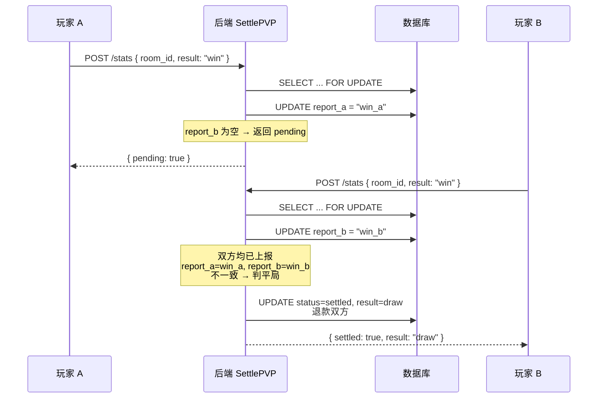
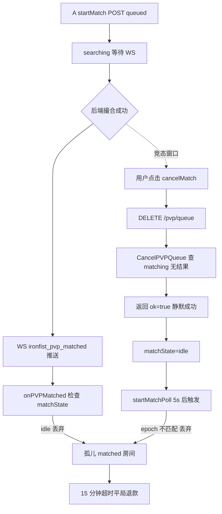
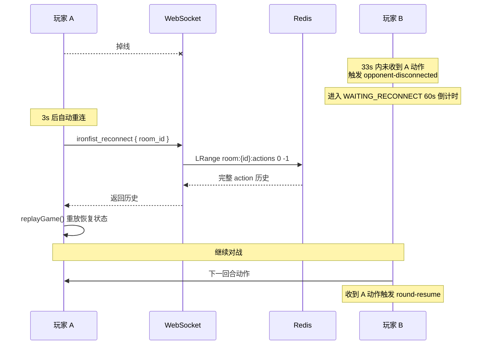
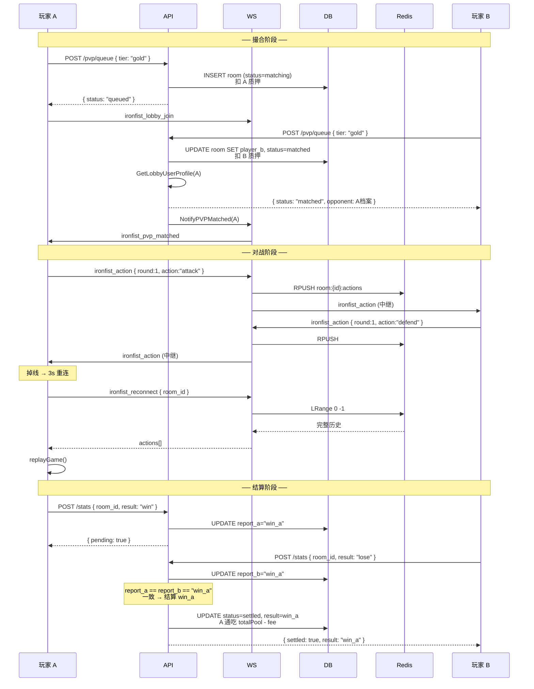

# 铁拳 PVP 撮合对战 - 技术设计文档

> MVP 阶段 PVP 匹配对战实现说明，含撮合、质押、结算、超时兜底、断线重连等机制。
> 与 [ironfist.md](./ironfist.md) 互补：前者描述游戏玩法，本文档聚焦 PVP 撮合与资金流。

---

## 一、概述

PVP 模式基于"档位质押 + 全局撮合队列 + 双上报仲裁"实现：

- 玩家选择 `gold` / `platinum` / `diamond` 三档之一入队，按档位质押 `$FIST`
- 后端按"同档位、先入队者优先"撮合，撮合成功双方进入对战页
- 对战结束后双方各自上报结果，**双方一致才结算**，不一致判平局（防作弊）
- 全程有超时兜底：撮合等待 5 分钟、已匹配未结算 15 分钟，避免质押永久锁定

### 档位与质押

| 档位 | 单人质押 | 总奖池 | 胜负手续费 | 平局手续费 |
|------|----------|--------|------------|------------|
| gold | 100 | 200 | 5% | 2.5% |
| platinum | 1000 | 2000 | 5% | 2.5% |
| diamond | 10000 | 20000 | 5% | 2.5% |

> 手续费拆分：一半销毁（`fee_burn`）、一半国库（`fee_treasury`）。MVP 阶段仅记账，未来接入链上合约时改为真实 burn/treasury 转账。

---

## 二、数据库 Schema

表 `ironfist_pvp_rooms`（[migration 008](../backend/migrations/008_ironfist_pvp_matchmaking.sql)）：

```sql
CREATE TABLE ironfist_pvp_rooms (
  id                BIGINT UNSIGNED AUTO_INCREMENT PRIMARY KEY,
  tier              VARCHAR(16)     NOT NULL,                 -- gold / platinum / diamond
  stake_amount      BIGINT          NOT NULL,                 -- 单人质押金额

  -- 玩家 A（房间创建者，先入队）
  player_a_user_id  BIGINT UNSIGNED NOT NULL,
  player_a_chat_id  VARCHAR(64)     NOT NULL,

  -- 玩家 B（匹配到的对手，匹配前为 NULL）
  player_b_user_id  BIGINT UNSIGNED NULL,
  player_b_chat_id  VARCHAR(64)     NULL,

  -- 状态机：matching → matched → settled / cancelled
  status            ENUM('matching','matched','settled','cancelled') NOT NULL DEFAULT 'matching',

  -- 结算结果（仅 settled）：win_a / win_b / draw / doubleLose
  result            VARCHAR(16)     NULL,
  -- 双方上报的房间视角结果（防作弊：一致才结算，不一致判平局）
  report_a          VARCHAR(16)     NULL,
  report_b          VARCHAR(16)     NULL,

  -- 资金字段（仅 settled，用于审计）
  winner_amount     BIGINT          NOT NULL DEFAULT 0,       -- 赢家到手（含本金）
  refund_a          BIGINT          NOT NULL DEFAULT 0,       -- 平局 A 退回
  refund_b          BIGINT          NOT NULL DEFAULT 0,       -- 平局 B 退回
  fee_burn          BIGINT          NOT NULL DEFAULT 0,       -- 销毁部分
  fee_treasury      BIGINT          NOT NULL DEFAULT 0,       -- 国库部分

  created_at        DATETIME(3)     NOT NULL DEFAULT CURRENT_TIMESTAMP(3),
  matched_at        DATETIME(3)     NULL,
  settled_at        DATETIME(3)     NULL,

  KEY idx_pvr_tier_status (tier, status),
  KEY idx_pvr_player_a (player_a_user_id),
  KEY idx_pvr_player_b (player_b_user_id)
) ENGINE=InnoDB;
```

**关键字段说明**：
- `report_a` / `report_b`：玩家视角上报的结果（已转换为房间视角，如 A 上报"我赢" → `win_a`）。首次写入不可修改，确保防作弊。
- `result`：仲裁后的最终结果，仅在 `settled` 时填写。
- 资金字段（`winner_amount` / `refund_*` / `fee_*`）作为审计快照，与 `fist_transactions` 流水一一对应。

---

## 三、API 接口

| 方法 | 路径 | 说明 | 鉴权 |
|------|------|------|------|
| POST | `/api/games/ironfist/pvp/queue` | 入队撮合 | session |
| DELETE | `/api/games/ironfist/pvp/queue` | 取消撮合（仅 matching 可取消） | session |
| GET | `/api/games/ironfist/pvp/queue` | 查询队列状态（轮询兜底） | session |
| POST | `/api/games/ironfist/stats` | 上报对局结果（触发结算） | session |

### 1. POST `/pvp/queue` - 入队撮合

**请求**：
```json
{ "tier": "gold" }
```

**响应**（三种情况）：

```jsonc
// 情况 A：作为玩家 A 进入等待队列
{ "status": "queued", "room_id": 123, "tier": "gold", "stake": 100 }

// 情况 B：作为玩家 B 立即撮合成功
{
  "status": "matched",
  "room_id": 123,
  "tier": "gold",
  "stake": 100,
  "opponent": { "chat_id": "...", "nickname": "...", "fist_balance": 5000 },
  "waiting": "对手 chatID"
}

// 错误：余额不足
HTTP 402 { "error": "insufficient $FIST balance" }

// 错误：已在一场对局中
HTTP 409 { "error": "already in an active match" }
```

**核心逻辑**（[EnqueuePVP](../backend/internal/service/ironfist.go#L485)）：
1. 事务内 `FOR UPDATE` 锁定 `$FIST` 账户，校验余额
2. 重复入队检查：同时检查 A/B 身份（避免已作为 B 在 matched 房间时再次入队）
3. 撮合：`SELECT ... FROM ironfist_pvp_rooms WHERE tier=? AND status='matching' AND player_a_user_id<>? ORDER BY id ASC LIMIT 1 FOR UPDATE`
4. 命中 → 作为 B 加入，扣质押，房间置 `matched`
5. 未命中 → 作为 A 创建新房间，扣质押，房间置 `matching`

### 2. DELETE `/pvp/queue` - 取消撮合

**响应**：
```json
{ "ok": true }
```

**核心逻辑**（[CancelPVPQueue](../backend/internal/service/ironfist.go#L676)）：
- 仅能取消 `status='matching'` 的房间，全额退款
- `matched` 房间会被静默跳过（返回 `ok=true` 但不退款）——前端需配合 `GET /pvp/queue` 复查（见第六节竞态处理）

### 3. GET `/pvp/queue` - 查询队列状态

**响应**：
```jsonc
// 在队列等待
{ "status": "queued", "room_id": 123, "tier": "gold", "stake": 100 }

// 已匹配
{
  "status": "matched",
  "room_id": 123,
  "tier": "gold",
  "stake": 100,
  "opponent": { ... }
}

// 无在队
{ "status": "idle" }
```

**用途**：玩家 A 的 WS 通知丢失兜底——前端每 5 秒轮询此接口，发现 `matched` 立即进入对战页。

### 4. POST `/stats` - 上报结果触发结算

详见第五节"双上报仲裁结算"。

---

## 四、WebSocket 协议

### 客户端 → 服务端

| 类型 | 触发场景 | payload |
|------|----------|---------|
| `ironfist_lobby_join` | 进入 PVP 大厅 | `{}` |
| `ironfist_lobby_leave` | 离开 PVP 大厅 | `{}` |
| `ironfist_action` | 对战中发送动作 | `{ room_id, round, action, from }` |
| `ironfist_reconnect` | 重连后拉取历史 | `{ room_id }` |
| `game_resign` | 认输 | `{ room_id }` |

### 服务端 → 客户端

| 类型 | 触发场景 | payload |
|------|----------|---------|
| `ironfist_lobby_update` | 大厅有人加入/离开 | `{ count, users: [...] }` |
| `ironfist_pvp_matched` | 玩家 A 被撮合成功通知 | `{ room_id, opponent, tier, stake }` |
| `ironfist_action` | 中继对手动作 | `{ room_id, round, action, from }` |

### 关键可靠性保障

**匹配通知阻塞发送**（[hub.go:586](../backend/internal/ws/hub.go#L586)）：
```go
select {
case c.send <- msg:
case <-time.After(2 * time.Second):
    log.Printf("[ws] notify pvp matched: %s send buffer full after 2s, room may be swept as draw")
}
```
匹配通知丢失会导致玩家 A 永远停留在搜索页且房间变孤儿，因此用阻塞发送 + 2s 超时替代 `default` 丢弃。即便如此仍可能丢失（玩家离线），由前端 5s 轮询 + 15 分钟超时兜底。

---

## 五、双上报仲裁结算

### 流程



### 仲裁规则

| 双方上报 | 最终结果 | 资金分配 |
|----------|----------|----------|
| 一致（如 A 赢 / B 输） | `win_a` | A 通吃 `totalPool - fee(5%)` |
| 一致（如 B 赢 / A 输） | `win_b` | B 通吃 `totalPool - fee(5%)` |
| 一致（双方都报平局） | `draw` | 双方各退 97.5% |
| 一致（双方都报双输） | `doubleLose` | 双方各退 97.5% |
| **不一致** | `draw`（防作弊兜底） | 双方各退 97.5% |

### 幂等性

- 已 `settled` 的房间再次上报：返回 `{ settled: false, result: <stored> }`，不重复结算
- 本方已上报相同结果：返回 `{ pending: true }`，不重复写入
- 本方已上报不同结果：被忽略（首次为准不可修改）

### 资金分配公式

```
totalPool = stake * 2

胜负结算（win_a / win_b）：
  totalFee = totalPool * 5 / 100          // 5%
  winnerAmount = totalPool - totalFee
  feeBurn = totalFee / 2
  feeTreasury = totalFee - feeBurn         // 余数归国库

平局结算（draw / doubleLose）：
  totalFee = totalPool * 25 / 1000         // 2.5%
  refundTotal = totalPool - totalFee
  refundA = refundTotal / 2
  refundB = refundTotal - refundA          // 余数归 B，确保费率恒为 2.5%
  feeBurn = totalFee / 2
  feeTreasury = totalFee - feeBurn
```

> 余数归 B / 国库的设计确保 `refund_a + refund_b + totalFee == totalPool` 恒成立，费率精确。

---

## 六、撮合与取消的竞态处理

### 玩家 A 的竞态窗口



**修复方案**（[IronFistPvpLobby.vue:340-352](../frontend/src/games/ironfist/components/IronFistPvpLobby.vue#L340-L352)）：

`cancelMatch` 成功返回后，主动调用 `GET /pvp/queue` 复查：
- 若发现 `status=matched` → 直接 `emitMatched` 进入对战页（matched 房间无法取消，强行丢弃只会让对手空等）
- 若仍是 `queued`/`idle` → 正常置 idle

### matchEpoch 代际计数器

防止"过期异步响应"污染当前状态：
- `startMatch` 入口 `++matchEpoch`，POST 返回后校验 epoch
- `cancelMatch` 入口 `++matchEpoch`，使进行中的 POST 响应失效
- `startMatchPoll` 携带 epoch，每轮校验

### 玩家 B 立即匹配的取消处理

`startMatch` 中 POST 返回 `matched` 时，**即便用户在 POST 飞行期间点了取消也直接进入**——matched 房间无法取消，强行丢弃只会让对手空等并触发 15 分钟超时退款。

---

## 七、超时兜底机制

后端 cron 每 1 分钟扫描两次（[main.go:215-240](../backend/cmd/server/main.go#L215-L240)）：

### 1. SweepTimeoutPVPQueues - 撮合等待超时

| 项 | 值 |
|----|-----|
| 触发条件 | `status='matching'` 且 `created_at < NOW() - 5min` |
| 处理 | 全额退给 A，状态置 `cancelled` |
| 超时常量 | `PVPMatchTimeout = 5 * time.Minute` |

### 2. SweepTimeoutPVPMatched - 已匹配未结算超时

| 项 | 值 |
|----|-----|
| 触发条件 | `status='matched'` 且 `matched_at < NOW() - 15min` |
| 处理 | 按平局退款（双方各退 97.5%），状态置 `settled`，`result='draw'` |
| 超时常量 | `PVPMatchedTimeout = 15 * time.Minute` |

**为何 15 分钟**：`matched_at` 在撮合时写入后不再刷新，该超时是"从撮合成功到必须结算"的硬上限，**必须 ≥ 单局最大真实时长**，否则会把进行中的正常对局误扫成平局、抢走赢家胜利并多扣手续费。对战上限 `MAX_ROUNDS(20) × ROUND_SECONDS(30s) = 600s(10 分钟)`，叠加掉线后 60s 重连窗口（可能多次），实际最长约 11~115 分钟，故取 15 分钟安全覆盖 + 缓冲。代价：撮合后无人开局的孤儿房间最长锁定 15 分钟才退款（罕见，前端已尽力主动取消并在离开大厅时复查 matched 改为进入对战）。

> ⚠️ 早期版本误设为 15 分钟（错误依据"10 回合 × 30s"且回合上限实际是 20），会误杀超过 15 分钟的正常对局，已修复。

### 前端兜底超时

| 项 | 值 | 触发动作 |
|----|-----|----------|
| 匹配等待兜底 | 10 分钟 | 置 error 状态 + best-effort 取消 |
| WS 通知丢失轮询 | 5 秒/次 | 发现 matched 立即进入对战页 |

---

## 八、断线重连机制

### 1. WebSocket 自动重连

- 断线后 **3 秒**自动重连（[websocket.js:111-116](../frontend/src/services/websocket.js#L111-L116)），固定间隔无指数退避
- `listeners` Map 在重连后保留，监听器自动生效
- 重连后需主动发送业务消息（如 `ironfist_reconnect` / `ironfist_lobby_join`）恢复业务状态

### 2. 对战中掉线重连



### 3. 关键时间常量

| 常量 | 值 | 含义 | 代码位置 |
|------|-----|------|----------|
| `OPPONENT_GRACE_MS` | 33 秒 | 收方等待对方动作宽限（30s 决策 + 3s 网络） | GameConstants.js:51 |
| `RECONNECT_WINDOW_MS` | 60 秒 | 进入等待重连后的总窗口 | GameConstants.js:54 |
| WS 重连间隔 | 3 秒 | 自动重连固定间隔 | websocket.js:114 |

### 4. 等待重连期间的行为

- 前端显示"等待对手重连 · 剩余 60s"倒计时
- **不允许放弃认输**：PVP 一旦开始就必须有结果
- 60s 内对方重连 → 收到动作触发 `round-resume`，恢复倒计时继续对战
- 60s 内未重连 → 判掉线方负，本方 `win`
- gameover 后对方延迟重连补发动作会被 `_onNetAction` 检查 `GAME_OVER` 拦截

### 5. 撮合阶段断线

Hub.Unregister 触发 5 秒宽限期取消（[hub.go:140-156](../backend/internal/ws/hub.go#L140-L156)）：
```go
go func(chatID string) {
    time.Sleep(5 * time.Second)
    h.mu.RLock()
    _, online := h.clients[chatID]
    h.mu.RUnlock()
    if online {
        return // 已重连，跳过取消
    }
    h.ironFistSvc.CancelPVPQueue(context.Background(), chatID)
}(c.ChatID)
```

5 秒宽限期避免 WS 自动重连（3s）被误判为离线导致取消。

### 6. 状态恢复原理（无状态分叉）

- 所有动作通过 `RPUSH` 存入 Redis（room 作用域，30 分钟 TTL）
- 重连时 `LRange 0 -1` 拉取完整历史
- 客户端 `replayGame(actions, myChatId)` 重放出当前状态
- 重放完成后切到 `playing` 视图，从中断回合继续

#### 倒计时同步（避免重连方拿到全新 30s）

DECIDING 倒计时锚定在"本回合起始时间戳"上，而非每次进入都从满 30s 起算：

- 引擎在每回合 `_startRound` 记录 `_roundStartedAt = Date.now()`（本端时钟），并持久化到
  `localStorage['ironfist:round:{roomId}']`（`LS_ROUND_KEY`）。
- 刷新重连后 `loadReplay` 恢复"进行中回合"时，读回该时间戳，UI 按 `30s − 已耗时` 续算，
  重连方不再白拿一整个 30s。
- `round-start` / `round-resume` 事件均携带 `startedAt`，UI `startCountdown(startedAt)` 据此计算剩余；
  对手先出招触发的 `round-resume` 也不会把本端倒计时重置回 30s。
- **无跨端时钟漂移**：每端只用自己的时钟锚定自己的回合起点（回合两端开始时间相差仅一个网络往返），
  从不拿对端时间戳做减法。对局结束/认输时与 pending action 一并清理该 key。

### 7. 刷新页面不认输

`beforeunload` 不发 `game_resign`——发 resign 会清理 Redis action 日志 + localStorage，导致无法重连。刷新页面保留 Redis 日志与 localStorage pending 状态，重新进入时通过 `ironfist_reconnect` 恢复对局。

---

## 九、资金安全与防作弊

### 1. 事务与锁

- **账户行锁**：`FOR UPDATE` 锁定 `$FIST` 账户行，防止并发扣款与提现冲突
- **房间行锁**：撮合、结算、取消均 `FOR UPDATE` 锁定房间行，防止并发撮合重复加入
- **ensureFistAccountTx**：结算前确保双方账户行存在，避免 UPDATE 影响行数为 0

### 2. 防作弊机制

| 风险 | 防护 |
|------|------|
| 单方上报决定结果 | 双上报仲裁：双方一致才结算，不一致判平局 |
| 上报结果不可修改 | `report_a`/`report_b` 首次写入后不可修改（幂等校验） |
| 同时处于多场对局 | 重复入队检查 A/B 双身份，matched 状态拒绝入队 |
| 并发请求双扣质押 | `FOR UPDATE` 锁定账户 + 房间行 |
| 自匹配 | 撮合 SQL `player_a_user_id <> ?` 拦截 |

### 3. 资金安全兜底

| 场景 | 兜底机制 |
|------|----------|
| 客户端崩溃未上报 | 15 分钟超时按平局退款 |
| WS 通知丢失 | 阻塞发送 2s + 前端 5s 轮询 + 15 分钟超时 |
| 撮合后无人开局 | 15 分钟超时按平局退款 |
| 撮合阶段断线 | 5s 宽限期 + 5 分钟超时全额退款 |
| 玩家 A 取消时已被撮合 | cancelMatch 复查 getPVPQueueStatus，已 matched 则直接进入 |

### 4. 流水审计

每笔资金变动都写入 `fist_transactions` 流水：
- `pvp_loss`：质押扣款（负数）
- `pvp_win`：胜利奖励（正数，含本金）
- `pvp_refund`：取消/平局退款（正数）

流水备注包含档位与对手 chatID，便于对账。

---

## 十、关键时间常量汇总

| 阶段 | 超时 | 处理 | 代码位置 |
|------|------|------|----------|
| 撮合等待（matching） | 5 分钟 | 全额退给 A，状态 cancelled | [ironfist.go:726](../backend/internal/service/ironfist.go#L726) |
| 已匹配未结算（matched） | 15 分钟 | 按平局退款，状态 settled | [ironfist.go:818](../backend/internal/service/ironfist.go#L818) |
| WS 匹配通知发送 | 2 秒 | 阻塞发送超时记日志，由轮询+超时兜底 | [hub.go:598](../backend/internal/ws/hub.go#L598) |
| WS 通知丢失轮询 | 5 秒/次 | 前端轮询 GET /pvp/queue 兜底 | IronFistPvpLobby.vue:283 |
| 前端匹配等待兜底 | 10 分钟 | 置 error + best-effort 取消 | IronFistPvpLobby.vue:268 |
| 对战决策窗口 | 30 秒/回合 | 超时未出招判负 | GameConstants.js |
| 对战中断线宽限 | 33 秒 | 进入等待重连 | GameConstants.js:51 |
| 等待重连窗口 | 60 秒 | 判掉线方负 | GameConstants.js:54 |
| WS 断线重连 | 3 秒 | 自动重连 | websocket.js:114 |
| 撮合队列断线宽限 | 5 秒 | 未重连则取消退款 | hub.go:144 |
| Redis action 日志 TTL | 30 分钟 | 自动过期清理 | hub.go |

---

## 十一、前端关键文件

| 文件 | 职责 |
|------|------|
| [IronFistPvpLobby.vue](../frontend/src/games/ironfist/components/IronFistPvpLobby.vue) | PVP 大厅 UI、撮合发起/取消、WS 监听、轮询兜底 |
| [IronFistPage.vue](../frontend/src/games/ironfist/IronFistPage.vue) | 对战页、对战初始化、断线重连、gameover 上报 |
| [IronFistGame.js](../frontend/src/games/ironfist/game/IronFistGame.js) | 游戏状态机、回合结算、重放、等待重连逻辑 |
| [GameConstants.js](../frontend/src/games/ironfist/game/GameConstants.js) | 时间常量定义 |
| [websocket.js](../frontend/src/services/websocket.js) | WS 连接管理、自动重连、事件分发 |
| [api.js](../frontend/src/services/api.js) | HTTP API 封装 |

## 十二、后端关键文件

| 文件 | 职责 |
|------|------|
| [service/ironfist.go](../backend/internal/service/ironfist.go) | PVP 业务逻辑：撮合、取消、结算、超时扫描 |
| [handler/ironfist.go](../backend/internal/handler/ironfist.go) | HTTP handler |
| [ws/hub.go](../backend/internal/ws/hub.go) | WS 连接管理、动作中继、断线清理、大厅广播 |
| [cmd/server/main.go](../backend/cmd/server/main.go) | 路由注册、cron 启动 |
| [migrations/008_ironfist_pvp_matchmaking.sql](../backend/migrations/008_ironfist_pvp_matchmaking.sql) | 数据库 schema |

---

## 十三、完整 PVP 流程时序



---

## 十四、已知风险与修复记录

### 已修复

| 编号 | 问题 | 修复方案 |
|------|------|----------|
| 1 | SettlePVP 先上报者决定结果，可作弊 | 双上报仲裁：双方一致才结算，不一致判平局 |
| 2 | matched 房间无超时清理，断线即锁死质押 | SweepTimeoutPVPMatched 每 1 分钟扫描，15 分钟超时按平局退款 |
| 3 | WS 匹配通知静默丢失 | 阻塞发送 2s + 前端 5s 轮询兜底 |
| 4 | 取消与入队竞态，质押被静默锁定 | matchEpoch 代际计数器 + 5s 宽限期 + FOR UPDATE 锁 |
| 5 | 同一用户可并发创建多个 matching 房间 | 重复入队检查 A/B 双身份 + FOR UPDATE 锁 |
| 6 | gold 档平局实际手续费 3% 而非 2.5% | 先算总手续费再分配余数，确保费率恒定 |
| 7 | EnqueuePVP 重复入队检查遗漏 player_b | 查询条件改为 `(player_a_user_id=? OR player_b_user_id=?)` |
| 8 | EnqueuePVP 返回 queued 时 tier 用请求值非房间实际值 | 查询时 SELECT tier/stake_amount，返回已有房间实际值 |
| 9 | cancelMatch 与撮合竞态，形成孤儿 matched 房间 | cancelMatch 成功后复查 getPVPQueueStatus，已 matched 则直接进入 |
| 10 | emitMatched 先置 null 再读 matchTier | savedTier 暂存 |
| 11 | pvpRoomId 未校验 | Number.isFinite && > 0 校验，非法阻断进入对局 |
| 12 | 取消失败静默回退 idle | 保留 error 状态提示重试 |

### 待优化（MVP 可接受）

- WS 重连无指数退避，网络抖动时可能频繁重连
- Redis action 日志 30 分钟 TTL，超长对局可能丢失历史（实际对局最长约 5 分钟，无影响）
- 手续费 MVP 阶段仅记账未实际销毁/转入国库，未来接入链上合约时补全
- 等待重连窗口固定 60s，未根据回合数动态调整（极端长对局末回合可能不够）
