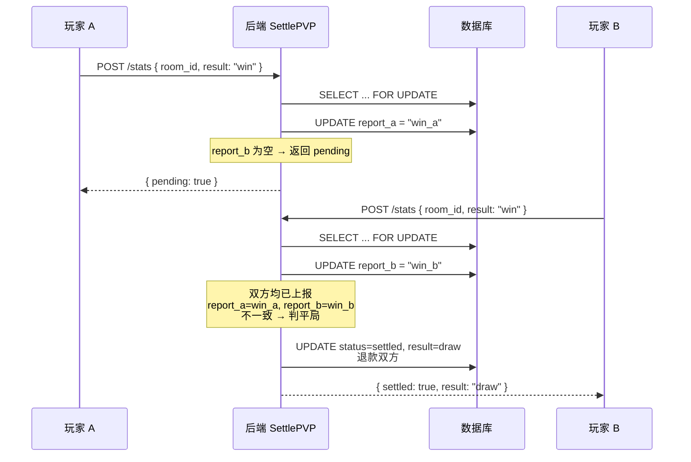
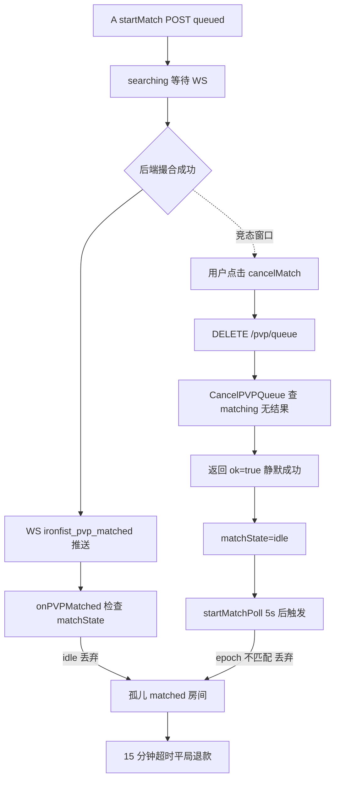
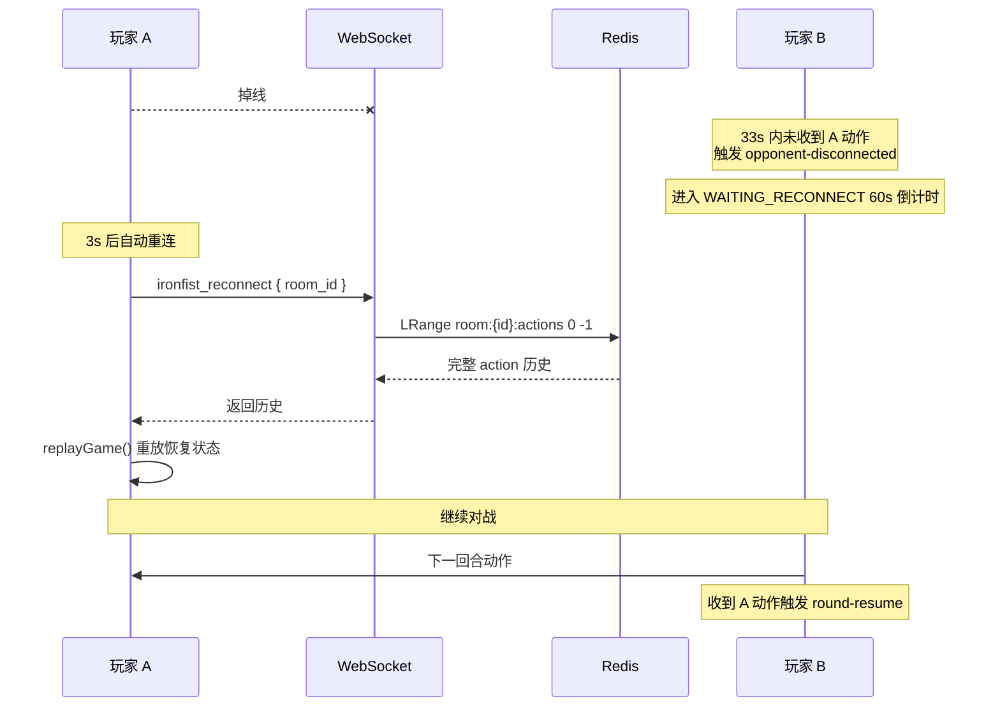
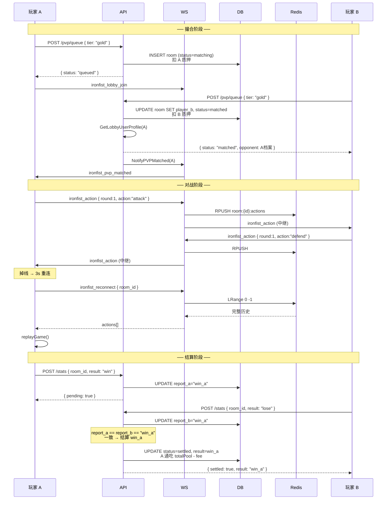

# 铁拳（Iron Fist）完整设计与技术文档

## 现行安全架构（2026-08-04）

所有可产生奖励、统计、成就或质押结算的对局均由服务端权威引擎执行。客户端只能通过以下接口创建/读取对局并提交单个动作：

- `POST /api/games/ironfist/pve/sessions`
- `GET /api/games/ironfist/sessions/active`
- `GET /api/games/ironfist/games/:id`
- `POST /api/games/ironfist/games/:id/actions`
- `POST /api/games/ironfist/games/:id/resign`

动作请求包含回合号、UUID 请求号和预期状态版本；服务端负责 AI 选择、回合重放、HP、胜负、超时、掉线判负以及同事务结算。WebSocket 仅发送可丢弃的状态通知，客户端发现版本缺口时从 MySQL 重新读取。旧的客户端结果上报、PvE 奖励领取、动作转发及 replay 通道均不参与现行流程。

“Offline practice” 是唯一使用本地规则引擎的模式，明确不产生奖励、统计、成就或账本变化。

部署时必须先应用 `021_ironfist_authority.sql`。服务启动使用 MySQL 锁 `ironfist-authority-rollout-v1` 完成一次性旧局退款，并以 `system_migration_markers` 持久记录；截止时间均使用 UTC。Redis 仅承载通知和临时在线状态，不是对局事实来源。

> 本文由原游戏设计、PVP 技术设计、3D 资产说明和 `$FIST` 代币经济设计四份文档整合而成。

## 当前版本口径（重要）

- **中国版是当前唯一启用版本，所有奖励、余额、质押和流水均使用站内积分。**
- 国际版及 `$FIST` 相关代码当前已停用；本文第四篇仅保留其历史设计，供未来重新评审，**不得作为现行开发或结算依据**。
- 核心玩法规则以第一篇为准；撮合、并发、重连和结算流程以第二篇为准；角色模型投放规范以第三篇为准。
- 文档出现的 `$FIST`、SPL Token、Solana、NFT、链上销毁、质押分红等内容，除第四篇历史存档外，均应按中国版“积分/站内记账”理解或视为未启用能力。

## 文档结构

1. [第一篇：核心玩法与游戏设计](#第一篇核心玩法与游戏设计)
2. [第二篇：PVP 撮合、同步与积分结算](#第二篇pvp-撮合同步与积分结算)
3. [第三篇：3D 角色资产接入](#第三篇3d-角色资产接入)
4. [第四篇：国际版 `$FIST` 经济模型（已停用/历史存档）](#第四篇国际版-fist-经济模型已停用历史存档)

---

# 第一篇：核心玩法与游戏设计

## 铁拳 - 回合制心理格斗小游戏

> MVP 设计文档（含数值平衡与技术方案）

---

### 一、游戏概述

**铁拳**是一款 **1v1 回合制心理博弈格斗游戏**，集成于云密（E2EE Chat）应用的游戏中心。

支持两种对战模式：

| 模式 | 说明 | 网络 |
|------|------|------|
| **PvP 人人对战** | 邀请在线好友进行对战，通过 WebSocket 实时同步 | 需要联网 |
| **PvE 人机对战** | 与本地 AI 对战，无需联网，随时可玩 | 纯本地 |

两种模式下，玩家通过"攻击 / 防御 / 蓄力 / 反击"四种基础动作进行对抗。每回合有 **30 秒决策时间**，双方同时选择动作后进行结算，循环直到一方 HP 归零。

核心体验：

> 猜测对手行为 + 做出策略选择 + 争取一回合优势

---

### 二、核心玩法循环

```
进入回合 → 30秒倒计时 → 双方选择动作 → 锁定 → 结算 → 更新状态 → 下一回合
```

循环直到一方 HP ≤ 0。

---

### 三、游戏状态机

#### PvP 人人对战

```
                    ┌──────────────────────────────────────┐
                    │                                      │
                    ▼                                      │
  ┌──────┐   invite   ┌──────────┐   accept   ┌─────────┐ │
  │ idle │ ─────────► │ inviting │ ─────────► │ playing │ │
  └──┬───┘            └────┬─────┘            └────┬────┘ │
     │                     │                       │      │
     │  invite             │ reject/timeout        │      │
     ▼                     ▼                       ▼      │
  ┌──────────┐        ┌───────┐              ┌────────┐  │
  │ invited  │ ──────►│ idle  │              │ result │  │
  └──────────┘ reject └───────┘              └───┬────┘  │
                                              │         │
                                              ▼         │
                                         ┌────────┐      │
                                         │ lobby  │ ◄────┘
                                         └────────┘  backToLobby

  playing 中刷新页面 / 掉线 → 重新挂载检测到 localStorage pending
                │
                ▼
         ┌───────────────┐  ironfist_reconnect   ┌────────────────┐
         │ reconnecting  │ ────────────────────► │ 服务端 LRANGE   │
         │ (重连中视图)  │ ◄─────────────────── │ │ 回送 replay    │
         └───────┬───────┘    ironfist_replay    └────────────────┘
                 │
                 ▼
           恢复到 playing（断线前的 round 继续）
```

#### PvE 人机对战

```
  ┌──────┐   点击人机对战   ┌─────────┐   HP≤0   ┌────────┐
  │ idle │ ──────────────► │ playing │ ───────► │ result │
  └──────┘                  └─────────┘          └───┬────┘
                                                  │
                                                  ▼
                                             ┌────────┐
                                             │ lobby  │
                                             └────────┘
```

PvE 模式跳过邀请流程，直接从 `idle` 进入 `playing`。

**状态说明：**

| 状态 | 说明 |
|------|------|
| `idle` | 空闲，可发起或接受邀请 |
| `inviting` | 已发出邀请，等待对方接受（30 秒超时自动取消） |
| `invited` | 收到邀请，可接受或拒绝 |
| `playing` | 对战进行中 |
| `result` | 对战结束，展示胜负结果 |

**战斗子状态（playing 内部）：**

```
round_start → deciding（30秒倒计时）→ locked → resolving → waiting_confirm → round_start / game_over
                                            │
                                            │ 对方 grace 超时未到动作（PvP 掉线）
                                            ▼
                                  waiting_reconnect（60s 重连窗口，不允许放弃）
                                            │
                                  ┌─────────┴─────────┐
                                  │                   │
                            对方重连            60s 超时
                                  │                   │
                            回到本回合         game_over(win)
```

| 子状态 | 说明 |
|--------|------|
| `round_start` | 回合开始，显示回合数，重置倒计时 |
| `deciding` | 双方选择动作，30 秒倒计时 |
| `locked` | 双方动作已锁定，不可更改（一方选完等另一方） |
| `resolving` | 结算克制关系、计算伤害、播放动画 |
| `waiting_confirm` | 结算动画播放完毕，等待玩家点击"下一回合"确认 |
| `waiting_reconnect` | **PvP 专用**：对手掉线，等待 60s 重连。不允许放弃等待认输，必须等满窗口或对方重连。60s 超时 → 判对方负（己方 win）。详见第十四节方案 B。 |
| `game_over` | 对局结束（HP=0 / 20 回合上限 / 僵局环境伤害致负 / 对方掉线判负 / 认输） |

> **已移除 `round_end`**：原状态机定义了 `round_end` 但实际流程未使用（HP/胜负检查在 `waiting_confirm` 后直接推进或进入 `game_over`），现已从常量中清理。

---

### 四、基础数值系统

#### 1. 玩家基础属性

| 属性 | 值 | 说明 |
|------|----|------|
| HP | 100 | 生命值，归零则败 |
| 攻击力 | 10 | 影响攻击伤害 |
| 防御值 | 0 | MVP 不做数值防御，全部由动作系统控制 |
| 气值（Energy） | 0 | MVP 可选，后续扩展用 |

#### 2. 数值平衡原则

- 满血不会被一击秒杀（常规蓄力攻击 24 ≈ 1/4 血）；残局互秒由残血护盾兜底（见第十节），不再用固定百分比上限描述
- 防御减伤 60%，但不完全免伤（避免防御拖平局）
- 蓄力成功 = 爆发，被抓 = 惩罚更重（高风险高收益）
- 反击成功很赚，失败会亏血（不稳定但高收益）
- 目标战斗长度 5~8 回合
- 无单一最优策略

**伤害取整规则**：所有伤害计算结果向上取整（`Math.ceil`），避免小数伤害。
例：`Math.ceil(12 × 0.4) = Math.ceil(4.8) = 5`

**乘区运算顺序**（必须严格按此顺序计算，避免歧义）：

```
最终伤害 = Math.ceil(
  基础伤害
  × 蓄力倍率（蓄力攻击时为 2，否则为 1）
  × 残血强化倍率（攻击方 HP < 30 时为 1.1，否则为 1）
  × 暴击倍率（10% 概率为 1.5，否则为 1）
  × 防御减伤系数（被防御时为 0.4，否则为 1）
)
```

> 注意：防御减伤在最后一步，意味着蓄力攻击打防御者 = `Math.ceil(12 × 2 × 0.4) = Math.ceil(9.6) = 10`。

---

### 五、动作系统与数值设计

#### 1. 攻击（Attack）

| 场景 | 伤害 | 说明 |
|------|------|------|
| 攻击 vs 防御 | 12 × 0.4 = **5** | 防御减伤 60% |
| 攻击 vs 攻击 | 双方各受 **12** | 风险对拼 |
| 攻击 vs 蓄力 | **18** | 打断蓄力（与"蓄力被打断惩罚 18"对称，见 §7） |
| 攻击 vs 反击 | 攻击方受 **20** | 被反击克制（与"反击成功 20"对称） |

特点：简单直接，容易被预测

#### 2. 防御（Defend）

| 场景 | 效果 | 说明 |
|------|------|------|
| 防御 vs 攻击 | 受到 12 × 0.4 = **5** 伤害 | 减伤 60% |
| 防御 vs 防御 | 无伤害 | 双方安全但无进展 |
| 防御 vs 蓄力 | 对方蓄力成功 | 亏节奏 |
| 防御 vs 反击 | 对方反击失败受 **8** 伤害 | 对方猜错 |

特点：抗压，克制攻击，但牺牲进攻节奏

#### 3. 蓄力（Charge）

| 场景 | 效果 | 说明 |
|------|------|------|
| 蓄力 vs 攻击 | 自身受 **18** 伤害，蓄力失败 | 被打断，额外惩罚（12 × 1.5） |
| 蓄力 vs 防御 | 蓄力成功，下回合伤害 ×2 | 对方亏节奏 |
| 蓄力 vs 蓄力 | 双方蓄力成功 | 下回合双方爆发 |
| 蓄力 vs 反击 | 蓄力成功，对方反击失败受 **8** 伤害 | 对方猜错 |

蓄力成功后攻击伤害 = 12 × 2 = **24**（常规单回合爆发值）

**蓄力状态持续与失效规则**（统一原 174/176 行矛盾）：

- 蓄力成功后设置蓄力标记，**最多保留 2 个"可用回合"**（常量 `CHARGE_HOLD_LIMIT = 2`）。
- "可用回合"指标记被携带进入决策但**未通过攻击消耗**的回合：每经过一个这样的回合计时 +1，达到 2 即失效（标记清除）。
- 即：第 N 回合蓄力成功 → 第 N+1、N+2 回合可用攻击 ×2；若到 N+2 仍未攻击，进入 N+3 前标记失效。
- 蓄力后选择防御/反击/再蓄力都**不消耗**标记，但**仍计入老化**（防止"蓄力 + 永久防御"乌龟流）。
- 选择攻击消耗标记、计时归零；机制 C 清除标记时计时也归零。

**蓄力标记叠加与冲突规则**（明确边界情况）：

| 场景 | 处理 | 说明 |
|------|------|------|
| 无标记 + 蓄力成功 | 设置标记 | 标准情况 |
| 有标记 + 蓄力成功 | 标记保留（不叠加） | 蓄力倍率始终为 ×2，不累积为 ×4 |
| 有标记 + 蓄力被打断 | **标记保留**（不丢失原有标记） | 仅本次蓄力失败，不影响已积累的标记 |
| 有标记 + 攻击 | 消耗标记，伤害 ×2，计时归零 | 标准消耗 |
| 有标记 + 防御/反击 | 标记保留但计时 +1 | 不消耗，但仍老化（最多 2 回合，见上文失效规则） |
| 双方同时有标记超过 2 回合 | 第 3 回合**结算阶段**清除双方标记（玩家第 3 回合决策时仍可见标记，结算时清零） | 见第九节僵局检测机制 C |

> 关键变更：原设计中"带着蓄力标记再蓄力被打断会清空原标记"不符合玩家直觉，已修正为"仅本次蓄力失败，原标记保留"。

特点：高风险高收益，容易被读穿

#### 4. 反击（Counter）

| 场景 | 效果 | 说明 |
|------|------|------|
| 反击 vs 攻击 | 反击成功，造成 **20** 伤害 | 核心博弈技能 |
| 反击 vs 防御 | 反击失败，自身受 **8** 伤害 | 猜错 |
| 反击 vs 蓄力 | 反击失败，自身受 **8** 伤害 | 猜错 |
| 反击 vs 反击 | 双方反击失败，各受 **8** 伤害 | 互相猜忌 |

特点：心理博弈核心，成功收益高，失败代价大

---

### 六、克制关系总表

| 玩家动作 | 对手动作 | 玩家受到 | 对手受到 | 判定 |
|----------|----------|----------|----------|------|
| 攻击 | 攻击 | 12 | 12 | 互伤 |
| 攻击 | 防御 | 0 | 5 | 防御减伤 |
| 攻击 | 蓄力 | 0 | 18 | 打断蓄力 |
| 攻击 | 反击 | 20 | 0 | 被反击 |
| 防御 | 攻击 | 5 | 0 | 成功防御 |
| 防御 | 防御 | 0 | 0 | 无事发生 |
| 防御 | 蓄力 | 0 | 0 | 对方蓄力成功 |
| 防御 | 反击 | 0 | 8 | 对方猜错 |
| 蓄力 | 攻击 | 18 | 0 | 蓄力被打断 |
| 蓄力 | 防御 | 0 | 0 | 蓄力成功 |
| 蓄力 | 蓄力 | 0 | 0 | 双方蓄力 |
| 蓄力 | 反击 | 0 | 8 | 对方猜错 |
| 反击 | 攻击 | 0 | 20 | 反击成功 |
| 反击 | 防御 | 8 | 0 | 反击失败 |
| 反击 | 蓄力 | 8 | 0 | 反击失败 |
| 反击 | 反击 | 8 | 8 | 双方失败 |

---

### 七、战斗结算流程

#### Step 1：锁定动作

- 双方在 30 秒内选择动作
- 超时未选择 → 自动执行"**防御**"（统一以第八节为准；旧版"自动攻击"已废弃，原因见第八节）
- 双方动作同时确定，互不可见（自己只能看到自己的选择，对方的选择在结算时才揭示）

#### Step 2：克制判定

- 根据克制关系总表判断优劣
- 确定伤害方向和倍率

#### Step 3：伤害计算

```
基础攻击伤害 = 12
防御减伤 = 60%（最终伤害 = 基础伤害 × 0.4）
蓄力加成 = 下回合伤害 × 2
蓄力被打断惩罚 = 基础伤害 × 1.5 = 18
反击成功伤害 = 20
反击失败自伤 = 8
```

#### Step 4：状态更新

- HP 变化（`HP = Math.max(0, HP - dmg)`，强制 clamp 到 0）
- 蓄力状态更新（按优先级判断）：
  1. 本回合选择**攻击**且已有蓄力标记 → 消耗蓄力标记（设为 false），伤害已在 Step 3 应用 ×2
  2. 本回合选择**蓄力**且被打断（playerDmg > 0）→ **保留原有蓄力标记**（不丢失，仅本次蓄力失败）
  3. 本回合选择**蓄力**且成功（playerDmg === 0）→ 设置蓄力标记为 true（若已有标记则保持，不叠加）
  4. 本回合选择**防御/反击** → 蓄力标记保持原状（有则保留，无则无）
- 僵局计数器更新：
  - 若本回合双方均未造成伤害 → `consecutiveNoDamageRounds++`，否则归零
  - 若双方都持有蓄力标记 → `bothChargedStalemate++`，否则归零
  - `totalRounds++`

#### Step 5：回合结束

- 更新血条
- 播放伤害动画
- 检查胜负条件
- 重置倒计时，进入下一回合

---

### 八、30 秒回合机制

- 每回合固定 30 秒决策时间
- 玩家必须在时间内选择动作
- **超时未选择的默认动作规则**（避免误消耗蓄力标记）：
  - 玩家**无蓄力标记** → 自动执行"**防御**"（安全选项，不造成伤害也不消耗资源）
  - 玩家**有蓄力标记** → 自动执行"**防御**"（保留蓄力标记，避免被故意超时绕过博弈）
  - 不再使用"自动攻击"作为默认动作，原因：自动攻击会误消耗蓄力标记，且可被玩家利用"故意超时"绕过心理博弈
- 双方都选择后立即进入结算（不必等满 30 秒）

目的：
- 强制决策压力
- 防止无限思考
- 保持游戏节奏紧凑
- 超时惩罚为"放弃进攻机会"，而非"被迫消耗资源"

---

### 九、胜负条件

#### 1. 基本胜负判定

```
当任意一方 HP ≤ 0
→ 游戏结束
→ 判定胜利/失败
```

- 胜利方展示胜利动画
- 失败方展示失败动画
- 双方 HP 同时归零 → 平局
- **HP 强制 clamp 到 0**：`HP = Math.max(0, HP - dmg)`，UI 永远不显示负数

**`gameResult` 枚举**（`resolveRound` 返回值，UI/战绩上报据此分支）：

| 值 | 含义 | 触发 |
|----|------|------|
| `null` | 未结束，继续下一回合 | 双方 HP > 0 且未达回合上限 |
| `'win'` | 玩家胜 | 对手 HP ≤ 0（玩家 > 0）；或回合上限时玩家 HP 高 |
| `'lose'` | 玩家负 | 玩家 HP ≤ 0（对手 > 0）；或回合上限时对手 HP 高 |
| `'draw'` | 平局 | 双方同时归零；或回合上限 HP 相同 |
| `'doubleLose'` | 双败 | 回合上限时双方 HP 均 ≤ 5（机制 B，防极限拖延）|

> `doubleLose` 在 UI 上展示为"双双力竭"，**战绩按平局记入**（双方各记一平，与 `draw` 同口径；连胜清零、不计入胜负场）。

#### 2. 僵局检测（防无限平局）

为避免 `防御 vs 防御`、双方蓄力后互相威慑等僵局，引入以下机制：

**机制 A：连续无伤害回合上限**

- 连续 **5 回合** 双方均未造成任何伤害（即 `playerDmg === 0 && opponentDmg === 0`）→ 触发"环境伤害"打破僵局
- 从第 5 个连续无伤害回合起，**该回合结算时**双方各受环境伤害（与本回合动作伤害一并扣除，非"下回合开始"）
- 环境伤害**逐回合递增**：第 5 个无伤害回合 5 点，第 6 个 10 点，第 7 个 15 点……即 `envDmg = 5 × (连续无伤害回合数 − 5 + 1)`，确保僵局快速终结
- 一旦某回合产生了真实伤害，连续无伤害计数器归零，环境伤害重置

**机制 B：总回合上限**

- 总回合数达到 **20 回合** 仍未分出胜负 → 按剩余 HP 比例判定：
  - HP 高者胜
  - HP 相同 → 平局
  - 双方都 ≤ 5 HP → 双败（避免极限拖延）

**机制 C：蓄力威慑打破**

- 若双方同时持有蓄力标记超过 **2 回合** 都未消耗 → 第 3 回合**结算阶段**清除双方蓄力标记（玩家第 3 回合决策时仍可见标记、可基于标记出招，结算时清零；避免"核威慑"永久僵局）

#### 3. 状态追踪

游戏状态需新增字段：

```js
{
  consecutiveNoDamageRounds: 0,  // 连续无伤害回合数
  totalRounds: 0,                // 总回合数
  bothChargedStalemate: 0,       // 双方同时持有蓄力标记的回合数
  playerChargeUnused: 0,         // 玩家蓄力标记已携带未消耗的回合数（达 2 失效）
  opponentChargeUnused: 0,       // 对手同上
}
```

---

### 十、轻量随机性

| 系统 | 规则 | 是否 MVP | 说明 |
|------|------|----------|------|
| 暴击 | 10% 概率 ×1.5 伤害 | 否 | 增加不确定性，后续根据体验数据决定 |
| 残血强化 | HP < 30 → 攻击 +10% | **是** | 增加翻盘可能，缓解残局互秒问题 |
| 残血护盾 | HP < 20 时，单次受到伤害不超过当前 HP 的 60% | **是** | 防止残局被蓄力攻击（24 伤）一击秒杀，给劣势方反击机会 |

#### 残血机制详细说明（MVP 必须实现）

**残血强化**：
- 触发条件：攻击方 HP < 30
- 效果：该次攻击伤害 ×1.1（向上取整）
- 例：基础 12 伤害 → `Math.ceil(12 × 1.1) = Math.ceil(13.2) = 14`
- 蓄力攻击：`Math.ceil(12 × 2 × 1.1) = Math.ceil(26.4) = 27`

**残血护盾**：
- 触发条件：被攻击方 HP < 20
- 效果：单次受到伤害上限 = `Math.ceil(当前HP × 0.6)`
- 例：HP = 15 时，单次最多受 `Math.ceil(15 × 0.6) = 9` 伤害（即使被 24 伤蓄力攻击也只扣 9）
- 目的：避免残局"谁先手谁赢"的互秒局面，让劣势方至少能再行动 1~2 回合

> 这两个机制共同作用：残血方攻击更强（强化）、被击杀更慢（护盾），形成翻盘窗口期。

---

### 十一、PvE 人机对战模式

#### 1. 模式说明

PvE 模式下，玩家直接与本地 AI 对战，无需邀请好友、无需联网。从大厅点击"人机对战"即可立即开始。

与 PvP 的区别：

| 对比项 | PvP 人人对战 | PvE 人机对战 |
|--------|-------------|-------------|
| 对手 | 在线好友 | 本地 AI |
| 网络 | WebSocket 实时同步 | 纯本地，无网络通信 |
| 邀请流程 | 需要（invite → accept） | 不需要，直接开始 |
| 动作同步 | 双方各自选择后互发消息 | AI 在本地即时生成动作 |
| 倒计时 | 30 秒（双方都有压力） | 30 秒（仅玩家有压力，AI 瞬时决策） |
| 状态机 | idle → inviting → playing → result | idle → playing → result |

#### 2. AI 行为模型（MVP）

NPC 行为为**状态感知概率模型**，在基础概率上根据双方蓄力状态调整，避免出现"AI 有蓄力标记却去防御浪费"等不合理行为。

##### 基础概率（无特殊状态时）

| 动作 | 概率 |
|------|------|
| 攻击 | 50% |
| 防御 | 25% |
| 蓄力 | 15% |
| 反击 | 10% |

##### 状态感知调整规则

| 触发条件 | 调整 | 理由 |
|----------|------|------|
| AI 自己有蓄力标记 | 攻击概率提升至 **70%**，防御 20%，反击 10%，蓄力 0% | 有大就要用，避免浪费标记 |
| 玩家有蓄力标记 | 防御 40%，反击 35%，攻击 15%，蓄力 10% | 倾向克制玩家可能的蓄力攻击（防御减伤或反击成功） |
| 双方都有蓄力标记 | 攻击 60%，防御 30%，反击 10% | 互秒局面优先出手 |
| AI 的 HP < 30（残血强化触发） | 攻击概率 +15%（从基础概率提升） | 利用残血强化翻盘 |
| 玩家的 HP < 20（残血护盾触发） | 蓄力概率 +10% | 需要蓄力破护盾 |
| 连续 2 回合 AI 蓄力被打断 | 蓄力概率归零，攻击 +20% | 避免重复犯错 |

##### 决策伪代码

```js
function aiDecide(aiState, playerState, history) {
  let weights = { attack: 50, defend: 25, charge: 15, counter: 10 }

  if (aiState.charged) {
    weights = { attack: 70, defend: 20, charge: 0, counter: 10 }
  } else if (playerState.charged) {
    weights = { attack: 15, defend: 40, charge: 10, counter: 35 }
  }

  if (aiState.hp < 30) weights.attack += 15
  if (playerState.hp < 20) weights.charge += 10
  if (history.consecutiveChargeInterrupted >= 2) {
    weights.charge = 0
    weights.attack += 20
  }

  return weightedRandom(weights)
}
```

说明：
- 保持"可读但不完全可预测"
- 避免明显不合理的行为（如有大不用、重复犯错）
- 后续可升级为基于玩家行为历史的简单预测模型

#### 3. AI 决策时机

- 玩家选择动作并锁定后，AI 立即生成动作（模拟"同时选择"）
- AI 不需要等待 30 秒，但玩家仍受 30 秒倒计时约束
- AI 动作在结算时才揭示给玩家（与 PvP 体验一致）

#### 4. AI 难度扩展方向（非 MVP）

| 难度 | 策略 | 说明 |
|------|------|------|
| 简单 | 纯随机概率 | MVP 版本 |
| 普通 | 统计玩家行为频率，倾向克制玩家常用动作 | 基于历史 |
| 困难 | 记忆玩家最近 N 回合序列，预测下一动作 | 简单马尔可夫链 |

---

### 十二、3D 场景与 UI 设计

#### 设计理念

采用 **3D 战斗场景 + 2D UI 覆盖层** 的混合架构：战斗画面由 Babylon.js 渲染 3D 角色和场景，策略决策信息（HP、倒计时、动作按钮）用 2D HUD 覆盖在 3D 画面之上。

目标体验：**3D 格斗游戏的画面表现 + 心理博弈的策略深度**。

美术风格：**Low Poly 低多边形**，兼顾性能与表现力，角色面数控制在 5k 以内。

参考方向：
- 《暗影格斗 3》的镜头语言与打击感
- 《Marvel Snap》的竖屏信息层次
- Low Poly 风格的《堡垒之夜》简化质感

---

#### 1. 战斗场景 3D 设计

##### 场景布局（竖屏）

```
┌─────────────────────────┐
│  Round 3        ⏳22s   │  ← HUD 顶部（2D 覆盖）
├─────────────────────────┤
│                         │
│         /─────\         │
│        │ NPC   │        │  ← 3D 远景角色（对手）
│         \─────/         │
│      ███████░░░ 72      │  ← HUD 血条（2D 覆盖）
│                         │
│  ─────────────────────  │  ← 场景中线（地面）
│                         │
│      █████████░ 85      │  ← HUD 血条（2D 覆盖）
│         /─────\         │
│        │ 玩家  │        │  ← 3D 近景角色（玩家）
│         \─────/         │
│                         │
├─────────────────────────┤
│ [攻击]  [防御]           │  ← HUD 操作区（2D 覆盖）
│ [蓄力]  [反击]           │
└─────────────────────────┘
```

- **3D 场景**：竖向擂台，玩家在下方（近），对手在上方（远）
- **2D HUD**：覆盖在 3D Canvas 之上，用 Vue 组件渲染，保证文字清晰度和点击响应
- **镜头**：略带俯视角（约 15°），强化"对峙"感

##### 3D 场景元素

| 元素 | 说明 | 资源 |
|------|------|------|
| 战斗擂台 | 圆形/方形地面平台，带边界光效 | Low Poly 模型，约 2k 面 |
| 背景环境 | 简化场馆/道场背景，烘托氛围 | Skybox + 远景低模 |
| 灯光 | 主光 + 补光 + 边缘光，突出角色 | Babylon.js 光照系统 |
| 粒子 | 蓄力能量、打击火花、胜利金光 | ParticleSystem |

##### 镜头系统

| 状态 | 镜头位置 | 说明 |
|------|----------|------|
| 回合开始 | 全景，包含双方角色 | 展示对峙 |
| 决策阶段 | 略微推进，聚焦玩家 | 突出决策压力 |
| 结算动画 | 动态切换到攻击方/受击方 | 强化打击感（见动画系统） |
| 胜利/失败 | 胜者特写 / 败者倒地全景 | 情绪渲染 |

镜头过渡使用 Babylon.js `Animation` 系统，缓动函数 `CubicEase`，过渡时间 300-500ms。

---

#### 2. 角色设计

##### Low Poly 角色规格

| 属性 | 规格 | 说明 |
|------|------|------|
| 面数 | ≤ 5000 三角面 | 中端机性能预算 |
| 纹理 | 512×512（最大 1024×1024） | Low Poly 风格无需高分辨率 |
| 骨骼 | ≤ 30 骨骼 | 兼顾动作丰富度与性能 |
| 材质 | PBR 简化材质 + 卡通描边（可选） | Low Poly 质感 |

##### 角色资源

| 角色 | 来源 | 说明 |
|------|------|------|
| 玩家角色 | Mixamo/Sketchfab 免费模型 | Low Poly 风格，需统一骨骼 |
| NPC 角色 | Mixamo/Sketchfab 免费模型 | 与玩家风格一致 |
| 角色变体 | 后续扩展 | 不同职业/皮肤 |

##### 动作动画（Animation Clip）

每个角色需准备以下动作动画（从 Mixamo 获取或通用骨骼重定向）：

| 动作 | 时长 | 说明 | 触发场景 |
|------|------|------|----------|
| Idle 待机 | 循环 | 呼吸、轻微晃动 | 决策阶段 |
| Attack 攻击 | 0.6s | 挥拳/挥剑前冲 | 选择攻击 |
| Defend 防御 | 0.4s | 举盾/格挡姿势 | 选择防御 |
| Charge 蓄力 | 1.0s | 蓄力发光姿势 | 选择蓄力 |
| Counter 反击 | 0.8s | 闪避+反击动作 | 选择反击 |
| Hit 受击 | 0.5s | 后仰/踉跄 | 被攻击命中 |
| Stagger 硬直 | 0.6s | 蓄力被打断 | 蓄力被打断 |
| Victory 胜利 | 循环 | 庆祝姿势 | 游戏胜利 |
| Defeat 失败 | 1.0s | 倒地 | 游戏失败 |

> Mixamo 提供大量免费动作捕捉动画，可直接下载 FBX/GLB 格式，骨骼绑定后即可使用。

---

#### 3. UI 覆盖层（HUD）

HUD 用 Vue 3 + Quasar 组件实现，覆盖在 3D Canvas 之上，保证文字清晰和交互响应。

##### 屏幕布局

| 区域 | 比例 | 渲染层 | 内容 |
|------|------|--------|------|
| 顶部信息栏 | 8% | 2D HUD | 回合数 + 倒计时 |
| 对手血条区 | 7% | 2D HUD | 对手 HP + 蓄力状态 |
| 3D 战斗区 | 55% | 3D Canvas | 角色对战 + 特效 |
| 玩家血条区 | 7% | 2D HUD | 玩家 HP + 蓄力状态 |
| 战斗信息区 | 8% | 2D HUD | 上回合结果 + 伤害数字 |
| 操作区 | 15% | 2D HUD | 四个动作按钮 |

##### 动作按钮设计

```
┌──────────┐  ┌──────────┐
│    ⚔️     │  │    🛡️     │
│   攻击    │  │   防御    │
│  12伤害   │  │ 减伤60%  │
└──────────┘  └──────────┘
┌──────────┐  ┌──────────┐
│    ⚡     │  │    🔄     │
│   蓄力    │  │   反击    │
│ 下回合x2  │  │ 克制攻击  │
└──────────┘  └──────────┘
```

- 2×2 网格布局，大按钮易点击
- 每个按钮显示：图标 + 动作名 + 简要效果
- 选中后高亮，不可重复点击
- 按钮带 3D 悬浮效果（CSS transform + shadow）

##### 回合锁定状态

玩家选择动作后，3D 角色播放对应预备动画，HUD 显示等待状态：

```
┌─────────────────────┐
│      已选择：攻击    │
│                     │
│   等待对手决策...    │
│                     │
│   对方剩余 ⏳18s    │
└─────────────────────┘
```

##### 回合结算覆盖层

结算动画期间，3D 场景播放动作对决，HUD 显示结算信息：

```
┌─────────────────────┐
│      回合结算        │
├─────────────────────┤
│                     │
│ ⚔️ 你攻击成功        │
│                     │
│ 🤖 NPC蓄力被打断     │
│                     │
│ 造成18伤害          │
│                     │
│ HP:72→54            │
│                     │
│ [下一回合]          │
└─────────────────────┘
```

---

#### 4. 必须显示的信息

| 位置 | 信息 | 渲染层 |
|------|------|--------|
| 顶部 | 回合数、倒计时 | 2D HUD |
| 对手区域 | HP、蓄力状态 | 2D HUD |
| 玩家区域 | HP、蓄力状态 | 2D HUD |
| 3D 场景 | 角色动作、特效、镜头 | 3D Canvas |
| 中央 | 上回合结果、伤害数字 | 2D HUD |
| 底部 | 四个动作按钮 | 2D HUD |

#### 5. MVP 不做的事

先不要加：摇杆操作、技能树、装备栏、背包、商城、聊天、世界地图、角色定制。先把 **3D 战斗表现 + 攻击/防御/蓄力/反击** 这一套玩得有画面感。

---

#### 6. 3D 动画系统

##### 动画状态机

角色动画由 Babylon.js `AnimationGroup` 管理，状态切换如下：

```
                    ┌──────────┐
                    │  Idle    │ ◄────────────┐
                    └────┬─────┘              │
                         │ 选择动作            │
            ┌────────────┼────────────┐       │
            ▼            ▼            ▼       │
      ┌──────────┐ ┌──────────┐ ┌──────────┐ │
      │ Attack   │ │ Defend   │ │ Charge   │ │
      └────┬─────┘ └────┬─────┘ └────┬─────┘ │
           │            │            │       │
           │    ┌───────┘            │       │
           ▼    ▼                    ▼       │
      ┌──────────┐            ┌──────────┐   │
      │ Counter  │            │  Stagger │   │
      └────┬─────┘            └────┬─────┘   │
           │                       │         │
           ▼                       ▼         │
      ┌──────────┐            ┌──────────┐   │
      │   Hit    │            │   Hit    │   │
      └────┬─────┘            └────┬─────┘   │
           │                       │         │
           └───────────┬───────────┘         │
                       ▼                     │
                 ┌──────────┐                │
                 │ Victory  │ / Defeat       │
                 └──────────┘                │
                       │                     │
                       └─────────────────────┘
                       （下一回合回到 Idle）
```

##### 结算动画时序

双方动作确定后，按以下时序播放结算动画：

| 时间 | 镜头 | 攻击方 | 受击方 | 特效 |
|------|------|--------|--------|------|
| 0ms | 切换到攻击方侧后方 | 起手预备动作 | Idle | - |
| 200ms | 跟随攻击动作 | Attack 动画播放 | - | 起手光效 |
| 500ms | 切换到受击方 | - | Hit/Stagger 动画 | 打击火花 + 屏幕震动 |
| 600ms | 全景 | 收招 | 后仰 | 伤害数字弹出（3D 空间） |
| 1200ms | 回到默认机位 | Idle | Idle | - |

- 镜头切换使用 `Camera.interpolateTo()`，过渡 200ms
- 屏幕震动使用 `Camera.shake()`，强度根据伤害值
- 伤害数字用 3D 空间中的 `DynamicTexture` Sprite，向上漂浮 + 淡出

##### 特效系统

| 场景 | 特效 | 实现 |
|------|------|------|
| 攻击命中 | 打击火花 + 屏幕震动 | ParticleSystem + Camera.shake |
| 防御成功 | 护盾光效 + 格挡音效 | 透明球体材质 + 动画 |
| 蓄力中 | 能量聚集 + 角色发光 | 环绕粒子 + 自发光材质 |
| 蓄力攻击 | 强化攻击拖尾 | TrailMesh + 强化粒子 |
| 反击成功 | 闪避残影 + 反击光效 | 残影 Sprite + 爆发粒子 |
| 反击失败 | 踉跄 + 失误提示 | 角色晃动动画 + 红色闪烁 |
| 蓄力被打断 | 硬直 + 能量消散 | 粒子爆散 + 灰色滤镜 |
| HP 减少 | 血条平滑减少 + 伤害数字 | HUD 动画 + 3D 数字 |
| 胜利 | 金色光柱 + 胜利姿势 | 粒子系统 + 镜头特写 |
| 失败 | 灰色滤镜 + 倒地 | 后处理 + 动画 |
| 僵局环境伤害 | 全场震动 + 红色警示 | 屏幕震动 + 边缘红光 |

##### 后处理效果

| 效果 | 触发场景 | 实现 |
|------|----------|------|
| 慢动作 | 反击成功 / 蓄力攻击命中 | `Scene.timeScale = 0.3`，持续 500ms |
| 屏幕震动 | 任意伤害命中 | `Camera.shake(intensity, duration)` |
| 色调分离 | 残血状态（HP<20） | `DefaultRenderingPipeline` + 色差 |
| 模糊 | 蓄力中 | `DepthOfFieldEffect` 聚焦角色 |
| 灰度 | 失败 | `DefaultRenderingPipeline.grain` |

---

### 十三、技术方案

#### 1. 整体架构

前端 Vue 3 + Quasar 页面驱动，**Babylon.js 负责 3D 渲染**，WebSocket 信令中继，无服务端游戏逻辑。

**渲染分层架构：**

```
┌─────────────────────────────────────────────┐
│              IronFistPage.vue               │
├─────────────────────────────────────────────┤
│                                             │
│  ┌─────────────────┐  ┌──────────────────┐ │
│  │   2D HUD 层      │  │   3D Canvas 层    │ │
│  │   (Vue + Quasar) │  │   (Babylon.js)   │ │
│  │                  │  │                  │ │
│  │  - 血条/倒计时   │  │  - 角色模型      │ │
│  │  - 动作按钮      │  │  - 场景/灯光     │ │
│  │  - 结算信息      │  │  - 动画/特效     │ │
│  │  - 大厅/结果页   │  │  - 镜头控制      │ │
│  └────────┬────────┘  └────────┬─────────┘ │
│           │                    │           │
│           └─────────┬──────────┘           │
│                     ▼                      │
│           ┌──────────────────┐             │
│           │  游戏逻辑核心     │             │
│           │  IronFistGame.js │             │
│           │  (状态机 + 结算)  │             │
│           └────────┬─────────┘             │
│                    │                       │
│         ┌──────────┼──────────┐            │
│         ▼          ▼          ▼            │
│   ┌──────────┐ ┌────────┐ ┌──────────┐    │
│   │ GameNet  │ │ GameAI │ │ ResourceManager│ │
│   │ (PvP)    │ │ (PvE)  │ │ (3D 资源) │    │
│   └──────────┘ └────────┘ └──────────┘    │
└─────────────────────────────────────────────┘
```

**PvP 人人对战：**

```
  玩家A (前端)                    玩家B (前端)
  ┌──────────┐   WebSocket   ┌──────────┐
  │ IronFist │ ◄───────────► │ IronFist │
  │  Page    │    中继转发     │  Page    │
  │ +Babylon │               │ +Babylon │
  └──────────┘               └──────────┘
        │                          │
        ▼                          ▼
  本地游戏逻辑               本地游戏逻辑
  (状态机 + 结算 + 3D)       (状态机 + 结算 + 3D)
```

**PvE 人机对战：**

```
  玩家 (前端)
  ┌──────────────────┐
  │   IronFist Page  │
  │   + Babylon.js   │
  │                  │
  │  ┌────────────┐  │
  │  │ 游戏逻辑    │  │  ← 状态机 + 结算
  │  └────────────┘  │
  │  ┌────────────┐  │
  │  │ AI 模块     │  │  ← 概率模型生成动作
  │  └────────────┘  │
  │  ┌────────────┐  │
  │  │ 3D 渲染     │  │  ← Babylon.js 场景
  │  └────────────┘  │
  └──────────────────┘
  （纯本地，无网络通信）
```

**关键设计：**
- **渲染分层**：3D Canvas 在底层，2D HUD 用绝对定位覆盖在上层，互不干扰
- **逻辑与渲染解耦**：`IronFistGame.js` 只管状态机和结算，不关心 3D 渲染；3D 层订阅状态变化播放动画
- PvP 模式：服务端仅做消息中继，双方各自在本地维护完整游戏状态，通过确定性同步保证一致性
- PvE 模式：完全本地运行，AI 动作由前端即时生成，无需任何网络通信

#### 2. Babylon.js 集成方案

##### 依赖安装

```bash
npm install @babylonjs/core @babylonjs/loaders @babylonjs/materials
```

- `@babylonjs/core`：核心引擎（渲染、场景、相机、光照、动画）
- `@babylonjs/loaders`：模型加载器（GLB/GLTF/FBX）
- `@babylonjs/materials`：扩展材质库

> 使用 ES Module 按需引入，配合 Vite 的 tree-shaking，减小打包体积。

##### 引擎初始化

```js
import { Engine, Scene, ArcRotateCamera, HemisphericLight, DirectionalLight } from '@babylonjs/core'

class IronFistRenderer {
  constructor(canvas) {
    this.engine = new Engine(canvas, true, {
      preserveDrawingBuffer: true,
      stencil: true,
      disableWebGL2Support: false,
    }, true)  // 第4个参数 true 启用自适应 DPR
    this.scene = new Scene(this.engine)
    this.setupCamera()
    this.setupLights()
    this.setupPipeline()

    // 自适应渲染循环
    this.engine.runRenderLoop(() => {
      this.scene.render()
    })

    // 窗口尺寸自适应
    window.addEventListener('resize', () => this.engine.resize())
  }

  setupCamera() {
    // 竖屏格斗视角：略带俯视
    this.camera = new ArcRotateCamera(
      'camera',
      -Math.PI / 2,  // alpha：正面
      Math.PI / 2 - 0.26,  // beta：俯视约 15°
      8,  // radius
      new Vector3(0, 1, 0),
      this.scene
    )
  }

  setupLights() {
    const hemi = new HemisphericLight('hemi', new Vector3(0, 1, 0), this.scene)
    hemi.intensity = 0.6
    const dir = new DirectionalLight('dir', new Vector3(-1, -2, -1), this.scene)
    dir.intensity = 0.8
    dir.position = new Vector3(5, 10, 5)
  }

  setupPipeline() {
    // 后处理管线：残血色调、慢动作等
    this.pipeline = new DefaultRenderingPipeline('pipeline', true, this.scene, [this.camera])
    this.pipeline.fxaaEnabled = true
    this.pipeline.bloomEnabled = true
    this.pipeline.bloomThreshold = 0.7
    this.pipeline.bloomWeight = 0.3
  }
}
```

##### 与 Vue 集成

```vue
<!-- IronFistPage.vue -->
<template>
  <div class="ironfist-page">
    <!-- 3D Canvas 层 -->
    <canvas ref="canvasRef" class="game-canvas" />

    <!-- 2D HUD 覆盖层 -->
    <div class="hud-overlay">
      <TopBar :round="round" :countdown="countdown" />
      <HealthBar v-for="p in players" :key="p.id" :player="p" />
      <ActionBar v-if="phase === 'deciding'" @select="onAction" />
      <ResultPanel v-if="phase === 'waiting_confirm'" :result="lastResult" @next="nextRound" />
    </div>
  </div>
</template>

<script setup>
import { ref, onMounted, onBeforeUnmount } from 'vue'
import { IronFistRenderer } from './game/Renderer'
import { IronFistGame } from './game/IronFistGame'

const canvasRef = ref(null)
let renderer, game

onMounted(() => {
  renderer = new IronFistRenderer(canvasRef.value)
  game = new IronFistGame()
  // 游戏状态变化 → 驱动 3D 动画
  game.on('stateChange', (state) => renderer.syncState(state))
})

onBeforeUnmount(() => {
  renderer?.dispose()
  game?.dispose()
})
</script>

<style scoped>
.ironfist-page {
  position: relative;
  width: 100%;
  height: 100vh;
  overflow: hidden;
}
.game-canvas {
  position: absolute;
  inset: 0;
  width: 100%;
  height: 100%;
  touch-action: none;  /* 防止移动端手势冲突 */
}
.hud-overlay {
  position: absolute;
  inset: 0;
  pointer-events: none;  /* 默认不拦截事件，子元素按需开启 */
}
.hud-overlay > * {
  pointer-events: auto;
}
</style>
```

#### 3. 确定性同步

由于回合制游戏的天然确定性（无实时操作、无随机地图），同步方案比炸弹人更简单：

- **回合同步**：双方各自选择动作后发送给对方，收到对方动作后本地结算
- **无随机性**：MVP 阶段无暴击等随机系统，结算结果完全由双方动作决定
- **无需 seed**：不像炸弹人需要共享随机种子
- **防作弊**：MVP 阶段信任客户端，后续可加服务端校验
- **3D 动画独立**：双方 3D 渲染各自独立，不影响游戏逻辑一致性

#### 4. 文件结构

```
frontend/src/games/ironfist/
├── IronFistPage.vue              # 游戏主页面（大厅/邀请/对战/结果）
├── components/                   # 2D HUD 组件
│   ├── TopBar.vue                # 顶部信息栏（回合 + 倒计时）
│   ├── HealthBar.vue             # 血条 + 蓄力状态
│   ├── ActionBar.vue             # 动作按钮区
│   ├── ResultPanel.vue           # 结算信息面板
│   └── Lobby.vue                 # 大厅视图
├── game/
│   ├── IronFistGame.js           # 游戏核心逻辑（状态机、结算、WAITING_RECONNECT、loadReplay）
│   ├── GameConstants.js          # 常量定义（HP、伤害、时间、RECONNECT_WINDOW_MS、LS_PENDING_KEY 等）
│   ├── GameNet.js                # 网络通信（PvP 模式，房间作用域过滤）
│   ├── GameAI.js                 # AI 决策模块（PvE 模式）
│   ├── resolve.js                # 结算核心（伤害表 + 乘区顺序 + 蓄力/残血/护盾）
│   ├── replay.js                 # 方案 B 重放工具：从 action 历史重放出当前游戏状态
│   └── three/                    # 3D 渲染模块
│       ├── Renderer.js           # Babylon.js 引擎封装
│       ├── SceneManager.js       # 场景管理（擂台、灯光、镜头）
│       ├── CharacterController.js # 角色控制（模型加载、动画切换）
│       ├── AnimationManager.js   # 动画状态机管理
│       ├── EffectManager.js      # 特效系统（粒子、后处理）
│       └── CameraController.js   # 镜头控制（机位切换、震动）
└── assets/
    └── models/                   # 3D 模型资源（GLB 格式）
        ├── arena.glb             # 战斗擂台
        ├── player.glb            # 玩家角色（含动画）
        ├── npc.glb               # NPC 角色（含动画）
        └── effects/              # 特效资源
            ├── hit_particle.png
            ├── charge_energy.png
            └── victory_beam.png
```

#### 5. 路由注册

在 `frontend/src/router/index.js` 中添加：

```js
{ path: 'games/ironfist', component: () => import('src/games/ironfist/IronFistPage.vue') }
```

#### 6. 游戏中心入口

在 `frontend/src/pages/GamesPage.vue` 中添加铁拳卡片：

```vue
<div class="col-6 col-sm-4 col-md-3">
  <q-card class="game-card cursor-pointer" @click="router.push('/games/ironfist')">
    <q-card-section class="text-center q-pa-lg">
      <div style="font-size: 52px">🥊</div>
      <div class="text-subtitle1 text-bold q-mt-sm">铁拳</div>
      <div class="text-caption text-grey-6">3D 回合制心理博弈</div>
    </q-card-section>
    <q-separator />
    <q-card-actions align="center" class="q-py-sm">
      <q-chip dense color="positive" text-color="white" icon="people" label="1v1" />
      <q-chip dense color="purple" text-color="white" icon="psychology" label="策略" />
      <q-chip dense color="deep-orange" text-color="white" icon="3d_rotation" label="3D" />
    </q-card-actions>
  </q-card>
</div>
```

#### 7. GameStore 扩展

现有 `useGameStore` 已支持邀请/接受/拒绝流程，铁拳游戏复用同一套邀请机制，仅需在 `invite()` 中将 `game` 字段改为 `'ironfist'`，并在路由跳转时指向 `/games/ironfist`。

```js
// 发送邀请时指定游戏类型
send('game_invite', { to: chatId, game: 'ironfist', room_id: roomId.value })

// 接受邀请后跳转到铁拳页面
_router?.push({
  path: '/games/ironfist',
  query: { opponent: opponentId.value, room: roomId.value, role: 'guest' },
})
```

---

### 十三.5、3D 资源管理

#### 1. 资源清单

| 资源 | 格式 | 大小预估 | 来源 | 说明 |
|------|------|----------|------|------|
| 战斗擂台 | GLB | ~200KB | Sketchfab Low Poly | 场景地面 + 边界 |
| 玩家角色 | GLB | ~500KB | Mixamo | 含骨骼 + 动画 |
| NPC 角色 | GLB | ~500KB | Mixamo | 含骨骼 + 动画 |
| 动作动画集 | GLB 内嵌 | - | Mixamo | 9 个动作（见第十二节） |
| 粒子贴图 | PNG | ~50KB | OpenGameArt | 火花、能量、光柱 |
| Skybox | JPG ×6 | ~300KB | OpenGameArt | 立方体贴图 |
| 音效 | MP3 | ~200KB | Freesound | 打击、蓄力、胜利等 |

**总资源体积预估：~1.8MB**（gzip 后约 1.2MB）

#### 2. 资源加载策略

##### 分阶段加载

```
阶段 1：大厅（进入页面立即加载）
  - 大厅 UI（Vue 组件）
  - 战绩数据（API 请求）

阶段 2：匹配中（点击对战后并行加载）
  - 战斗擂台 GLB
  - Skybox
  - 灯光/相机初始化

阶段 3：对战准备（进入 playing 状态）
  - 玩家角色 GLB + 动画
  - NPC 角色 GLB + 动画
  - 粒子贴图
  - 音效

阶段 4：按需加载（结算时）
  - 胜利/失败特效
  - 后处理资源
```

##### 加载进度展示

```vue
<template>
  <div v-if="loading" class="loading-overlay">
    <q-spinner-dots size="40px" />
    <div class="q-mt-sm">{{ loadingText }}... {{ progress }}%</div>
    <q-linear-progress :value="progress / 100" />
  </div>
</template>
```

##### 加载实现

```js
import { SceneLoader } from '@babylonjs/core'
import '@babylonjs/loaders'

class ResourceManager {
  constructor(scene) {
    this.scene = scene
    this.cache = new Map()
  }

  async loadArena(onProgress) {
    if (this.cache.has('arena')) return this.cache.get('arena')
    const result = await SceneLoader.ImportMeshAsync(
      '', './models/', 'arena.glb', this.scene, onProgress
    )
    this.cache.set('arena', result.meshes[0])
    return result.meshes[0]
  }

  async loadCharacter(type, onProgress) {
    // type: 'player' | 'npc'
    if (this.cache.has(type)) return this.cache.get(type)
    const result = await SceneLoader.ImportMeshAsync(
      '', './models/', `${type}.glb`, this.scene, onProgress
    )
    const mesh = result.meshes[0]
    const animationGroups = result.animationGroups
    this.cache.set(type, { mesh, animationGroups })
    return { mesh, animationGroups }
  }

  dispose() {
    this.cache.forEach(mesh => mesh.dispose?.())
    this.cache.clear()
  }
}
```

#### 3. 资源缓存

- **会话内缓存**：同一次页面访问内，模型加载后缓存在内存，重复进入对战不重新加载
- **浏览器缓存**：GLB/PNG 文件通过 HTTP 缓存头（Cache-Control: max-age=31536000）长期缓存
- **预加载**：大厅空闲时后台预加载角色模型，减少首次对战等待

#### 4. 资源优化

| 优化项 | 方案 | 预期收益 |
|--------|------|----------|
| 模型压缩 | 使用 `Draco` 压缩 GLB | 体积减少 50-70% |
| 纹理压缩 | 使用 KTX2/Basis 格式 | 体积减少 40-60%，GPU 解压快 |
| 动画合并 | 多个动作烘焙到同一 GLB | 减少请求次数 |
| LOD | 角色距离远时切换低面数模型 | 中端机帧率提升 |
| 纹理图集 | 粒子贴图合并为图集 | 减少 Draw Call |

---

### 十三.6、性能优化

#### 1. 性能目标

| 设备等级 | 目标帧率 | 模型面数 | 纹理分辨率 | 特效等级 |
|----------|----------|----------|------------|----------|
| 高端机 | 60 FPS | ≤ 10k | 1024×1024 | 全开 |
| 中端机（目标） | 30 FPS | ≤ 5k | 512×512 | 标准 |
| 低端机 | 24 FPS | ≤ 3k | 256×256 | 简化 |

#### 2. 设备检测与自适应

```js
class PerformanceDetector {
  static detect() {
    const canvas = document.createElement('canvas')
    const gl = canvas.getContext('webgl2') || canvas.getContext('webgl')
    if (!gl) return { tier: 'unsupported' }

    const debugInfo = gl.getExtension('WEBGL_debug_renderer_info')
    const renderer = debugInfo ? gl.getParameter(debugInfo.UNMASKED_RENDERER_WEBGL) : ''

    // 简单分级：根据 GPU 型号和内存
    const memory = navigator.deviceMemory || 4
    const cores = navigator.hardwareConcurrency || 4

    if (memory >= 8 && cores >= 8) return { tier: 'high' }
    if (memory >= 4 && cores >= 4) return { tier: 'medium' }
    return { tier: 'low' }
  }
}
```

#### 3. 渲染优化

| 优化项 | 实现 | 说明 |
|--------|------|------|
| 帧率限制 | `engine.setHardwareScalingLevel(1 / targetFps)` | 限制渲染频率 |
| 视锥剔除 | Babylon.js 默认开启 | 背面角色不渲染 |
| 阴影优化 | `ShadowGenerator.useExponentialShadowMap = true` | 软阴影性能更好 |
| 粒子数量控制 | 中端机粒子数 ×0.6，低端机 ×0.3 | 根据设备等级调整 |
| 后处理降级 | 低端机关闭 Bloom/DOF | 保证基础帧率 |
| 纹理压缩 | KTX2 格式 + Basis 解码 | 移动端 GPU 友好 |

#### 4. 内存管理

```js
class IronFistRenderer {
  dispose() {
    // 释放所有资源
    this.resourceManager?.dispose()
    // 停止渲染循环
    this.engine.stopRenderLoop()
    // 释放场景
    this.scene.dispose()
    // 释放引擎
    this.engine.dispose()
  }
}
```

- **页面卸载时必须释放**：Vue `onBeforeUnmount` 调用 `renderer.dispose()`
- **长时间空闲时降级**：切到后台时暂停渲染循环 `engine.stopRenderLoop()`，回前台时恢复
- **资源引用计数**：ResourceManager 跟踪资源使用，及时释放不再使用的模型

#### 5. 移动端适配

| 问题 | 解决方案 |
|------|----------|
| WebGL 兼容性 | 检测 WebGL 支持，不支持时降级为 2D 模式（CSS 动画） |
| 触摸事件冲突 | Canvas 设置 `touch-action: none`，HUD 按钮独立处理 |
| 内存不足 | 低端机自动降级模型面数和纹理 |
| 发热降频 | 限制 30 FPS，减少持续高负载 |
| 屏幕尺寸 | Canvas 自适应 `engine.resize()`，HUD 用响应式布局 |

#### 6. 降级方案

若设备不支持 WebGL 或性能严重不足，自动降级为 2D 模式：

```js
const tier = PerformanceDetector.detect()
if (tier.tier === 'unsupported') {
  // 降级为 CSS 动画模式（保留原 MVP 的简单实现作为 fallback）
  useFallback2DMode()
} else {
  // 使用 Babylon.js 3D 模式
  use3DMode(tier)
}
```

> 降级模式保留原 CSS 动画的简单实现，保证所有设备可玩，但无 3D 画面感。

---

### 十四、WebSocket 协议

#### 邀请阶段（复用现有协议）

| 方向 | 类型 | Payload | 说明 |
|------|------|---------|------|
| 发起方 → 服务端 | `game_invite` | `{ to, game: 'ironfist', room_id }` | 发起对战邀请 |
| 服务端 → 接收方 | `game_invite` | `{ from, game: 'ironfist', room_id }` | 转发邀请 |
| 接收方 → 服务端 | `game_accept` | `{ to, room_id }` | 接受邀请 |
| 服务端 → 发起方 | `game_accept` | `{ from, room_id }` | 通知发起方 |
| 任意方 → 服务端 | `game_reject` | `{ to, room_id, reason? }` | 拒绝/取消 |

#### 对战阶段（铁拳专用）

| 方向 | 类型 | Payload | 说明 |
|------|------|---------|------|
| 双方 → 服务端 | `ironfist_action` | `{ to, room_id, round, action, ts }` | 提交本回合动作；服务端 RPUSH 落 Redis + 中继给对方 |
| 双方 → 服务端 | `ironfist_reconnect` | `{ room_id }` | 请求重连：拉取本房间完整 action 历史 |
| 服务端 → 请求方 | `ironfist_replay` | `{ room_id, actions: [...] }` | 返回该房间至今的全部动作日志（按时间顺序） |
| 任意方 → 对方 | `game_resign` | `{ room_id }` | 认输（同时清理 Redis 中该房间的 action 日志） |

> **方案 B（事件溯源）核心：** 服务端只做"动作追加存储 + 中继转发"，不做任何游戏逻辑（HP/蓄力/胜负计算全在客户端）。断线重连时，断线方拉取完整 action 历史，本地用 `replayGame()` 重放出当前状态，无状态分叉风险。

> **已删除 `ironfist_state_sync` / `ironfist_ready`**：方案 B 不再需要客户端互相同步状态。所有"事实"以服务端 Redis 中的 action 流为准，任意一方只要拿到同一份 action 列表重放，必然得到相同状态。

**`ironfist_action` 详细定义：**

```js
{
  type: 'ironfist_action',
  payload: {
    to: 'chat_xxx',            // 对手的 chat_id（GameNet.send 自动注入）
    room_id: 'abc123',         // 房间 ID（GameNet.send 自动注入）
    round: 3,                  // 回合数（从 1 开始，用于校验）
    action: 'attack',          // 动作：attack / defend / charge / counter
    ts: 1719123456789,         // 时间戳
  }
}
```

服务端 `Hub.handleIronFistAction` 行为：
1. 解析 payload，校验 `to` 是合法 chat_id 且 `room_id` 非空
2. 追加存储项（含 `from` 字段，便于客户端重放时区分双方动作）到 Redis `ironfist:actions:{room_id}` 列表，使用 `RPUSH`
3. 刷新该 key 的 TTL 为 `IronFistActionsTTL = 30 分钟`（从最后一次活动起算，足够覆盖 60s 重连窗口 + 极端情况）
4. 中继给对方，注入 `from` 字段

**结算流程：**

1. 双方各自选择动作后发送 `ironfist_action`（同时落本地 + 落服务端 Redis）
2. 收到对方动作后，本地执行结算（无需等服务端）
3. 播放动画，更新 HP
4. 检查胜负，若继续则进入下一回合

**回合校验（防状态错位）：**

客户端收到 `ironfist_action` 时按 round 分发：
- `round === currentRound` → 直接结算（若双方动作齐）
- `round === currentRound + 1` → 暂存到 `_pendingOppByRound`，下一回合取出
- `round < currentRound` → 丢弃（过期，避免内存泄漏）
- `round > currentRound + 1` → 丢弃（异常未来，避免内存泄漏）

**超时处理：**

- 本地 30 秒倒计时结束未选择 → 自动发送 `action: 'defend'`（见第八节超时规则）
- 对方 30 秒内未收到动作 → 视为对方选择"防御"
- 超时方若持有蓄力标记，自动防御不会消耗标记

**断线重连（方案 B 事件溯源）：**

- **重连窗口：60 秒**。对手掉线后，等待方进入 `WAITING_RECONNECT` 阶段，最多等待 60 秒。
- **不允许放弃等待认输**：等待方在 60 秒内只能等待，不能主动结束对局。**PvP 一旦开始，就一定要有一个比赛的结果。**
- 60 秒内未重连 → 判断掉线方负（等待方 `gameover: 'win'`）。
- **断线方恢复流程**（页面刷新后）：
  1. 前端挂载时检测 `localStorage[ironfist:pending:{room_id}]` 是否存在未完成对局
  2. 若存在 → 显示「正在重连对局…」视图，发送 `ironfist_reconnect`
  3. 服务端 `Hub.handleIronFistReconnect` 用 `LRANGE 0 -1` 拉取完整 action 列表，回送 `ironfist_replay`
  4. 客户端 `IronFistGame.loadReplay()` 用 `replayGame()` 重放出当前状态：
     - 已完成回合数（结算过的双方动作）
     - 本回合进行中状态（双方动作未齐 → 取出我方/对方已选动作）
  5. localStorage 兜底：若断线前 `ironfist_action` 未送达服务端，从 `localStorage[ironfist:pending:{room_id}]` 恢复我方动作并补发
  6. 恢复到断线时的 round，继续对局
- **存储 TTL**：Redis 中 `ironfist:actions:{room_id}` 保留 30 分钟（`IronFistActionsTTL`），覆盖 60s 重连窗口 + 极端情况。
- **清理**：`game_resign` 或正常 gameover 时清理 Redis 该房间 action 日志 + localStorage pending action。

**方案 B 与状态同步方案的对比（为何选 B）：**

| 维度 | 状态同步（已废弃） | 方案 B：事件溯源（已采用） |
|------|-------------------|---------------------------|
| 服务端逻辑 | 仅转发 | 追加存储 + 转发 |
| 断线恢复 | 依赖对方主动回送状态（对方若也掉线则卡死） | 主动从服务端拉取 action 历史，自洽恢复 |
| 状态分叉风险 | 双方状态可能不一致 | 同一份 action 流重放必然一致 |
| 持久化 | 无 | Redis（30 分钟 TTL） |
| 客户端复杂度 | 状态同步协议 + 校验 | 重放函数 + localStorage 兜底 |

#### PvP 一致性补强（确定性同步的两个关键约束）

> 以下两点是 PvP 不分叉的前提，PvE 不受影响（本地单端结算）。

**1. 回合推进 barrier（解决 `waiting_confirm` 挂机卡死）**

`waiting_confirm` 等玩家点"下一回合"，但若一方挂机不点，另一方会永远卡住。规则：

- 玩家点"下一回合"后，本地从 `waiting_confirm` → `round_start(round+1)`，并把下一回合的动作锁定流程激活。
- **不需要为"确认"单独发消息**：对方进入下一回合的标志，就是收到对方 `ironfist_action` 且其 `round === 本地round + 1`。
- `waiting_confirm` 自身也设 **自动推进**：结算展示 `ROUND_HOLD_MS`（1.9s）/ `END_HOLD_MS`（1.7s，终局）后自动 `confirmNextRound()`，无需玩家手动点击，也避免单方挂机卡死。原 `CONFIRM_SECONDS = 15` 死代码常量已移除（自动推进已覆盖防挂机语义）。
- 因此回合推进的真正 barrier 是"双方的 `round+1` 动作都到齐才结算"，由 `ironfist_action.round` 字段对齐（见第十四节回合校验），与是否手动点确认解耦。

**2. 超时动作以"发送方本地判定"为唯一真相（解决两端分叉）**

两端计时器有网络延迟，不能各自独立判"对方超时"。规则：

- **只有动作的拥有者能决定自己是否超时**。A 的动作永远以 A 本地发出的 `ironfist_action` 为准；B 不得在本地"替 A 判超时"。
- A 本地 30 秒到点未选 → A 立即发送 `action: 'defend'`（带当前 round），这才是 A 本回合的真实动作。
- B 的等待上限放宽到 **33 秒**（30s + 3s 网络宽限）。33 秒内仍未收到 A 的动作 → 视为掉线，进入断线重连流程（而非直接替 A 判 defend 结算）。
- 这样同一回合 A 的动作在两端完全一致，结算结果确定，HP 不分叉。

**3. `game_resign` / 异常退出的战绩处理**

- 认输方记为负、对方记为胜；中途直接退出页面等同认输（离开 `playing` 前发送 `game_resign`）。
- 战绩上报由各端在本地结算出最终 `gameResult` 后上报自己的结果（MVP 信任客户端，不做双端交叉校验）。

---

### 十五、核心代码设计

#### 1. 游戏状态机（IronFistGame.js）

```js
// 游戏阶段
const PHASE = {
  ROUND_START: 'round_start',       // 回合开始
  DECIDING: 'deciding',             // 选择动作（30秒倒计时）
  LOCKED: 'locked',                 // 动作锁定（一方选完等另一方）
  RESOLVING: 'resolving',           // 结算动画
  WAITING_CONFIRM: 'waiting_confirm', // 等待玩家确认结算结果
  WAITING_RECONNECT: 'waiting_reconnect', // PvP：对手掉线，等待 60s 重连（方案 B）
  GAME_OVER: 'game_over',           // 游戏结束
}

// 动作类型
const ACTION = {
  ATTACK: 'attack',
  DEFEND: 'defend',
  CHARGE: 'charge',
  COUNTER: 'counter',
}
```

#### 2. 结算逻辑

```js
// 伤害表：[玩家动作][对手动作] = { playerDmg, opponentDmg }
// 注意：蓄力 ×2、残血强化、残血护盾不在此表中，由 resolveRound() 按乘区顺序额外计算
const DAMAGE_TABLE = {
  attack: {
    attack:   { playerDmg: 12, opponentDmg: 12 },
    defend:   { playerDmg: 0,  opponentDmg: 5  },   // 防御减伤 60%（Math.ceil(12×0.4)=5）
    charge:   { playerDmg: 0,  opponentDmg: 12 },    // 打断蓄力
    counter:  { playerDmg: 20, opponentDmg: 0  },     // 被反击（反击成功方造成 20 伤害，见第五节/第六节）
  },
  defend: {
    attack:   { playerDmg: 5,  opponentDmg: 0  },    // 成功防御
    defend:   { playerDmg: 0,  opponentDmg: 0  },
    charge:   { playerDmg: 0,  opponentDmg: 0  },     // 对方蓄力成功，下回合对方攻击 ×2
    counter:  { playerDmg: 0,  opponentDmg: 8  },     // 对方反击失败
  },
  charge: {
    attack:   { playerDmg: 18, opponentDmg: 0  },     // 蓄力被打断（12×1.5）
    defend:   { playerDmg: 0,  opponentDmg: 0  },     // 蓄力成功，下回合攻击 ×2
    charge:   { playerDmg: 0,  opponentDmg: 0  },     // 双方蓄力成功，下回合双方攻击 ×2
    counter:  { playerDmg: 0,  opponentDmg: 8  },     // 对方反击失败，自身蓄力成功
  },
  counter: {
    attack:   { playerDmg: 0,  opponentDmg: 20 },     // 反击成功
    defend:   { playerDmg: 8,  opponentDmg: 0  },     // 反击失败
    charge:   { playerDmg: 8,  opponentDmg: 0  },     // 反击失败
    counter:  { playerDmg: 8,  opponentDmg: 8  },     // 双方反击失败
  },
}

// 常量
const BASE_DAMAGE = 12
const DEFEND_REDUCTION = 0.4       // 防御减伤系数
const CHARGE_MULTIPLIER = 2        // 蓄力倍率
const LOW_HP_THRESHOLD = 30        // 残血强化阈值（攻击方）
const LOW_HP_BUFF = 1.1            // 残血强化倍率
const SHIELD_HP_THRESHOLD = 20     // 残血护盾阈值（被攻击方）
const SHIELD_RATIO = 0.6           // 残血护盾伤害上限比例
const STALE_NO_DMG_LIMIT = 5       // 连续无伤害回合上限
const STALE_ENV_DMG = 5            // 僵局环境伤害
const MAX_ROUNDS = 20              // 总回合上限
const BOTH_CHARGED_LIMIT = 2       // 双方同时蓄力标记僵局上限
```

#### 3. 蓄力状态处理与完整结算

```js
// 完整结算函数：按乘区顺序计算伤害，更新蓄力标记和僵局计数器
// 乘区顺序：基础 → 蓄力 → 残血强化 → 暴击(未实现) → 防御减伤 → 残血护盾
function resolveRound(playerAction, opponentAction, gameState) {
  const { playerHP, opponentHP, playerCharged, opponentCharged } = gameState
  let result = { ...DAMAGE_TABLE[playerAction][opponentAction] }

  // === 乘区 1：蓄力加成（直接对表内伤害 ×2）===
  // 关键 1：只有当攻击"本来就会造成伤害"时才放大（opponentDmg > 0）。
  //         否则蓄力攻击撞上"反击"（opponentDmg 应为 0）会被错误放大，反击成功方凭空挨打。
  // 关键 2：对**表内已减伤的值** ×2，而非从 BASE 重算。
  //         attack/defend：5 × 2 = 10 = ceil(12×2×0.4)；attack/attack：12 × 2 = 24。
  //         整数倍率下与严格乘区顺序结果一致；从 BASE 重算会丢掉防御减伤（把 10 错算成 24）。
  if (playerCharged && playerAction === 'attack' && result.opponentDmg > 0) {
    result.opponentDmg *= CHARGE_MULTIPLIER
  }
  if (opponentCharged && opponentAction === 'attack' && result.playerDmg > 0) {
    result.playerDmg *= CHARGE_MULTIPLIER
  }

  // === 乘区 2：残血强化（攻击方 HP < 30）===
  if (playerHP < LOW_HP_THRESHOLD && result.opponentDmg > 0) {
    result.opponentDmg = Math.ceil(result.opponentDmg * LOW_HP_BUFF)
  }
  if (opponentHP < LOW_HP_THRESHOLD && result.playerDmg > 0) {
    result.playerDmg = Math.ceil(result.playerDmg * LOW_HP_BUFF)
  }

  // === 乘区 3：残血护盾（被攻击方 HP < 20，单次伤害上限）===
  if (playerHP < SHIELD_HP_THRESHOLD && result.playerDmg > 0) {
    const cap = Math.ceil(playerHP * SHIELD_RATIO)
    result.playerDmg = Math.min(result.playerDmg, cap)
  }
  if (opponentHP < SHIELD_HP_THRESHOLD && result.opponentDmg > 0) {
    const cap = Math.ceil(opponentHP * SHIELD_RATIO)
    result.opponentDmg = Math.min(result.opponentDmg, cap)
  }

  // === 蓄力标记更新（按第五节规则）===
  // 关键：有标记 + 蓄力被打断 → 保留原标记（不丢失）
  let newPlayerCharged = playerCharged
  if (playerAction === 'attack' && playerCharged) {
    newPlayerCharged = false             // 消耗标记
  } else if (playerAction === 'charge' && result.playerDmg === 0) {
    newPlayerCharged = true              // 蓄力成功（已有则保持，不叠加）
  }
  // charge 被打断时 newPlayerCharged 保持 playerCharged 原值（保留原标记）
  // defend/counter 时保持原值

  let newOpponentCharged = opponentCharged
  if (opponentAction === 'attack' && opponentCharged) {
    newOpponentCharged = false
  } else if (opponentAction === 'charge' && result.opponentDmg === 0) {
    newOpponentCharged = true
  }

  // === 僵局计数器更新 ===
  const noDamage = result.playerDmg === 0 && result.opponentDmg === 0
  const newConsecutiveNoDmg = noDamage ? gameState.consecutiveNoDamageRounds + 1 : 0
  const newTotalRounds = gameState.totalRounds + 1
  const bothCharged = newPlayerCharged && newOpponentCharged
  let newBothChargedStalemate = bothCharged ? gameState.bothChargedStalemate + 1 : 0

  // === 僵局机制应用 ===
  // 机制 A：连续无伤害回合 → 本回合结算即扣环境伤害，逐回合递增
  let envDmg = 0
  if (newConsecutiveNoDmg >= STALE_NO_DMG_LIMIT) {
    envDmg = STALE_ENV_DMG * (newConsecutiveNoDmg - STALE_NO_DMG_LIMIT + 1)
  }
  // 机制 C：双方蓄力标记僵局 → 清除双方标记，并重置计数器（periodic 清除）
  // 不重置会导致计数器永不归零、此后每回合都清标记，永久剥夺双蓄力窗口
  if (newBothChargedStalemate > BOTH_CHARGED_LIMIT) {
    newPlayerCharged = false
    newOpponentCharged = false
    newBothChargedStalemate = 0
  }

  // === HP 更新（clamp 到 0）===
  const newPlayerHP = Math.max(0, playerHP - result.playerDmg - envDmg)
  const newOpponentHP = Math.max(0, opponentHP - result.opponentDmg - envDmg)

  // === 胜负判定 ===
  let gameResult = null
  if (newPlayerHP <= 0 && newOpponentHP <= 0) {
    gameResult = 'draw'
  } else if (newPlayerHP <= 0) {
    gameResult = 'lose'
  } else if (newOpponentHP <= 0) {
    gameResult = 'win'
  } else if (newTotalRounds >= MAX_ROUNDS) {
    // 机制 B：总回合上限。双方都 ≤5 HP → 双败（避免极限拖延），否则按剩余 HP 比
    if (newPlayerHP <= 5 && newOpponentHP <= 5) gameResult = 'doubleLose'
    else if (newPlayerHP > newOpponentHP) gameResult = 'win'
    else if (newPlayerHP < newOpponentHP) gameResult = 'lose'
    else gameResult = 'draw'
  }

  return {
    ...result,
    envDmg,
    playerHP: newPlayerHP,
    opponentHP: newOpponentHP,
    playerCharged: newPlayerCharged,
    opponentCharged: newOpponentCharged,
    consecutiveNoDamageRounds: newConsecutiveNoDmg,
    totalRounds: newTotalRounds,
    bothChargedStalemate: newBothChargedStalemate,
    gameResult,
  }
}

// 蓄力加成 = 直接对表内伤害 ×2（无需辅助函数）。详见上方乘区 1 注释。
```

> **注意（已实现验证）**：蓄力加成对 **DAMAGE_TABLE 表内已减伤的值** 做 `× CHARGE_MULTIPLIER`，而不是从 `BASE_DAMAGE` 重算。
> - `attack vs defend`：表值 5 × 2 = **10** = `Math.ceil(12 × 2 × 0.4)` ✓
> - `attack vs attack`：表值 12 × 2 = **24** ✓
> - 整数倍率下与"严格乘区顺序"结果完全一致，且自动正确处理防御减伤。
>
> ⚠️ 早期设计曾用 `return BASE_DAMAGE × 2`（恒为 24），这会**丢掉防御减伤**，把"蓄力攻击打防御者"错算成 24（应为 10）。单元测试已覆盖此用例，实现请勿回退到 BASE 重算方案。
>
> **修正（蓄力攻击被克制）**：蓄力加成必须加 `result.opponentDmg > 0` 守卫。否则带蓄力标记的攻击撞上"反击"时（`attack/counter` 的 `opponentDmg` 本应为 0、攻击方吃 20 反击伤），`applyCharge` 会无条件把对手伤害写成 24，让反击成功的一方反而挨打。加守卫后：蓄力攻击被反击 = 攻击方吃 20、对手 0 伤、蓄力标记消耗（committed 攻击的代价），符合直觉。
>
> 但由于 `DAMAGE_TABLE` 中已包含防御减伤结果，为避免重复减伤，`resolveRound` 需要区分"基础伤害"和"已减伤伤害"。完整实现建议将 `DAMAGE_TABLE` 拆分为"基础伤害表"和"减伤判定"，由 `resolveRound` 统一按乘区顺序计算。MVP 阶段可保持现有 `DAMAGE_TABLE` + `applyCharge` 的简化方案，因为数值结果一致。

---

### 十六、页面视图设计

IronFistPage.vue 包含 4 个视图：

| 视图 | 条件 | 说明 |
|------|------|------|
| `lobby` | 默认 | 大厅：选择对战模式（人机/人人） |
| `inviting` | `gameStore.state === 'inviting'` | 等待对方接受邀请（仅 PvP） |
| `playing` | `route.query.role` 或 `mode === 'pve'` | 对战进行中 |
| `result` | 对战结束 | 展示胜负结果 |

#### 大厅视图

大厅提供两个入口：

```
┌─────────────────────┐
│       🥊 铁拳        │
│   回合制心理博弈     │
├─────────────────────┤
│                     │
│  ┌───────────────┐  │
│  │  🤖 人机对战   │  │  ← 立即开始，无需联网
│  │  随时练习     │  │
│  └───────────────┘  │
│                     │
│  ┌───────────────┐  │
│  │  👥 好友对战   │  │  ← 需要邀请在线好友
│  │  实时 1v1     │  │
│  └───────────────┘  │
│                     │
├─────────────────────┤
│  游戏规则说明        │
│  4 种动作 + 克制关系 │
└─────────────────────┘
```

- **人机对战**：点击后直接进入 `playing`，`mode = 'pve'`，无需邀请流程
- **好友对战**：展开在线好友列表（复用 `friendApi.getFriends()`），点击好友 → 调用 `gameStore.invite()` 发起邀请
- 游戏规则说明（4 种动作 + 克制关系简表）

#### 对战视图

- 上方：对手信息（昵称 + HP 血条 + 蓄力状态）
- 中间：战斗动画区域（CSS 动画实现，无需游戏引擎）
- 下方：玩家信息 + 倒计时 + 4 个动作按钮

#### 结果视图

- 胜/负/平局图标和文字
- "返回大厅" 按钮

---

### 十七、后端改动

#### 1. Hub 消息中继（方案 B）

在 `backend/internal/ws/hub.go` 的 `dispatch` 方法中，`game_*` 类型（含 `game_resign`）走 `handleGameRelay`，铁拳专用消息走独立 handler：

```go
case "game_invite", "game_accept", "game_reject", "game_ready",
    "game_move", "game_bomb", "game_powerup", "game_death", "game_resign":
    h.handleGameRelay(c, msg.Type, msg.Payload)
case "ironfist_action":
    // 暂存到 Redis（断线重连用）+ 中继给对方
    h.handleIronFistAction(c, msg.Payload)
case "ironfist_reconnect":
    // 返回该房间完整 action 历史（ironfist_replay）
    h.handleIronFistReconnect(c, msg.Payload)
```

**`handleGameRelay` 中的铁拳清理钩子**：当 `msg.Type == "game_resign"` 且 payload 含 `room_id` 时，`Del` 掉 Redis 中 `ironfist:actions:{room_id}`，避免废弃对局的 action 日志残留。

> 方案 B 已删除 `ironfist_state_sync` / `ironfist_ready`：服务端不做游戏逻辑，仅追加存储 + 转发；状态恢复由客户端 `replayGame()` 重放完成。

#### 2. 胜场记录接口（MVP）

为支持进度系统，新增简单的胜场统计接口：

```go
// GET /api/games/ironfist/stats  → 获取当前用户胜场记录
// POST /api/games/ironfist/stats → 上报对局结果（win/lose/draw）
```

数据结构（可复用现有用户元数据表，无需新建表）：

```json
{
  "user_id": "xxx",
  "pvp_wins": 12,
  "pvp_losses": 5,
  "pvp_draws": 1,
  "pve_wins": 30,
  "pve_losses": 8,
  "max_win_streak": 7,
  "current_win_streak": 3
}
```

#### 3. 其他

回合制游戏无其他持久化数据需求，游戏过程状态在前端维护。

---

### 十八、MVP 设计目标

这个版本只追求四点：

#### 1. 可玩
- 能完整对战
- 有胜负
- 有僵局处理，不会出现永远打不完的局

#### 2. 有心理博弈
- 玩家需要猜对手行为
- 四种动作各有克制关系

#### 3. 有基本策略
- 防御 / 攻击 / 蓄力 / 反击之间有选择权
- 无单一最优策略

#### 4. 有翻盘与进度反馈
- 残血强化 + 残血护盾提供翻盘窗口
- 胜场记录提供长期目标（见第二十节）

---

### 十九、进度系统（MVP）

为提升短期留存，MVP 阶段引入轻量进度系统：

#### 1. 胜场记录

| 字段 | 说明 |
|------|------|
| PvP 胜/负/平 | 人人对战战绩 |
| PvE 胜/负/平 | 人机对战战绩 |
| 当前连胜 | 连续胜利次数 |
| 历史最高连胜 | 个人记录 |

- 数据存储在后端（复用用户元数据表），跨设备同步
- PvE 战绩也记录，方便玩家追踪练习进度

#### 2. 大厅展示

在大厅页面顶部展示个人战绩卡片：

```
┌─────────────────────┐
│  🥊 战绩             │
│  PvP: 12胜 5负 1平   │
│  PvE: 30胜 8负       │
│  连胜: 3 🔥          │
└─────────────────────┘
```

#### 3. 结果页上报

对战结束后，结果页自动上报战绩到后端，并展示战绩变化：

```
┌─────────────────────┐
│      🎉 胜利！       │
│                     │
│  PvP 战绩：13胜 5负  │
│  连胜：4 🔥          │
│                     │
│  [返回大厅]          │
└─────────────────────┘
```

#### 4. 简单成就（可选，非必须）

| 成就 | 条件 |
|------|------|
| 初出茅庐 | 完成 1 场对战 |
| 百战不殆 | 累计 100 场对战 |
| 连胜达人 | 连胜 5 场 |
| 反击大师 | 单场反击成功 3 次 |
| 残血翻盘 | HP < 10 时获胜 |
| 稳操胜券 | HP > 90 时获胜 |

成就仅本地存储，作为额外目标，不影响核心玩法。

---

### 二十、后续扩展方向（非 MVP）

| 方向 | 说明 |
|------|------|
| 状态系统 | 眩晕 / 破防 / 强化 |
| 连击系统 | 连续相同动作触发额外效果 |
| 技能系统 | 替换/增强基础动作 |
| NPC AI 学习 | 基于玩家行为历史调整概率 |
| 角色职业 | 不同角色有不同属性/技能 |
| 装备系统 | 影响属性和技能 |
| 暴击系统 | 10% 概率 ×1.5 伤害 |
| 气值系统 | 防御/反击消耗气值，攻击/蓄力回复气值 |
| 排行榜 | 全局胜率排名（MVP 仅个人战绩，无全局排名） |
| 回放系统 | 记录对战过程供复盘 |
| 角色定制 | 玩家自定义角色外观、皮肤、武器 |
| 动作捕捉 | 用真实动捕数据替换 Mixamo 通用动画 |
| 物理打击 | 布娃娃系统，受击物理反应 |

> 注：原"残血强化"已纳入 MVP（见第十节），此处移除。

---

### 二十一、总结

本 MVP 的核心：

> 用最少的 4 种动作 + 克制关系 + 风险收益设计 + 时间压力
> + 残血翻盘机制 + 僵局检测 + 状态感知 AI + 胜场记录
> + Babylon.js 3D 战斗场景 + Low Poly 美术 + 打击感动效
> 构建一个具有画面感与心理博弈深度的回合制 3D 格斗游戏

技术层面：

> Vue 3 + Quasar 负责 UI 与页面流程，Babylon.js 负责 3D 渲染
> 渲染分层：3D Canvas 底层 + 2D HUD 覆盖层，逻辑与渲染解耦
> 复用现有游戏邀请/通信架构，前端本地结算，服务端仅做消息中继
> 中端机 30 FPS 性能预算，低端机自动降级为 2D 模式

#### 关键设计决策汇总

| 问题 | 解决方案 | 章节 |
|------|----------|------|
| 数值取整歧义 | 统一 `Math.ceil`，明确乘区顺序 | 第四节 |
| 蓄力标记丢失 | 被打断时保留原标记 | 第五节、第七节 |
| 无限平局 | 连续无伤害环境伤害 + 总回合上限 + 蓄力僵局清除 | 第九节 |
| 超时误消耗标记 | 超时默认防御 | 第八节 |
| 残局互秒 | 残血强化 + 残血护盾 | 第十节 |
| AI 行为不合理 | 状态感知概率模型 | 第十一节 |
| PvP 状态错位 | round 校验 + 状态同步 | 第十四节 |
| 断线无恢复 | 重连协议 + 30 秒超时判负 | 第十四节 |
| HP 负数显示 | 强制 clamp 到 0 | 第九节、第十五节 |
| 缺乏进度反馈 | 胜场记录 + 成就 | 第十九节 |
| 画面表现力不足 | Babylon.js 3D 引擎 + Low Poly 美术 | 第十二节 |
| 移动端性能压力 | 设备检测 + 自适应画质 + 2D 降级 | 第十三.6节 |
| 3D 资源加载 | 分阶段加载 + 会话缓存 + Draco 压缩 | 第十三.5节 |
| 逻辑与渲染耦合 | 渲染分层架构，IronFistGame 只管状态机 | 第十三节 |

#### 漏洞修正记录（实现前 review）

| 漏洞 | 修正 | 章节 |
|------|------|------|
| 蓄力攻击被反击时算出 24 伤（应 0） | 蓄力加成加 `opponentDmg > 0` 守卫 | 第十五节 |
| 决胜回合文字"每回合+5"与代码"每5回合+5"不符 | 统一为逐回合递增 `5×(连续无伤回合−4)`，当回合结算即扣 | 第九节、第十五节 |
| 机制 B"双方≤5HP双败"未实现 | `resolveRound` 补 `doubleLose` 分支 | 第九节、第十五节 |
| `waiting_confirm` 一方挂机卡死全场 | 自动推进（`ROUND_HOLD_MS`/`END_HOLD_MS`）+ 以 `round+1` 动作到齐为推进 barrier | 第十四节 |
| PvP 超时两端各判分叉致 HP 不一致 | 超时动作以发送方本地判定为唯一真相，收方放宽到 33s | 第十四节 |
| `game_resign`/退出战绩处理未定义 | 退出等同认输，各端本地结算后上报 | 第十四节 |
| `applyCharge` 返回 `BASE×2` 丢失防御减伤 | 改为对表内值 `×2`（5→10 而非 24），单测锁死 | 第十五节 |

#### 代码 review 修正（一期实现后）

| 漏洞 | 影响 | 修正 |
|------|------|------|
| 伤害表不对称：`attack/charge.od=12≠charge/attack.pd=18`、`attack/counter.pd=18≠counter/attack.od=20` | **PvP 两端结算同回合得出不同 HP（desync）**；PvE 因"谁是 player"数值不公 | 统一为 §7 权威值（打断 18、反击 20），表恢复对称，已用脚本校验全 16 格 |
| 机制 C 计数器清标记后不归零 | 双蓄力一旦超 2 回合，此后**每回合都清标记**，永久剥夺双蓄力窗口 | 清标记时一并 `newBothChargedStalemate = 0`，改为每 3 回合周期性清除 |
| 对方认输 `game_resign` 只 emit gameover 不置 `GAME_OVER` | 对局已结束但本地倒计时/`selectAction` 仍可运行 | handler 内先 `_setPhase(GAME_OVER)` 再 emit |
| `lastResult` 跨回合不清除 | 新回合决策阶段信息栏显示上回合摘要，"选择你的动作"提示不出现 | round-start 时 `lastResult.value = null` |
| 蓄力失效期：174 行"下回合" vs 176 行"永不失效"矛盾，代码按永不失效 | 允许"蓄力 + 永久防御/反击留大"乌龟流，违背"无单一最优策略" | 统一为**最多保留 2 个可用回合**（`CHARGE_HOLD_LIMIT=2`），新增 `chargeUnused` 计时；引擎 state、PvP 同步字段同步补齐 |
| 平衡原则"单次有效伤害 ≤25% HP" | 实际最大单次 24~40，该表述与数值矛盾、误导 | 删除固定百分比表述，改为"满血不被秒杀 + 残血护盾兜底" |
| 缺少出招记录 | 心理博弈缺少复盘信息，看不到对手历史出招 | 对战界面新增横向滚动「出招记录」条（上=对手/下=你，胜负描边，最新在右）|
| 终局仍显示"下一回合"，点完才进结果页 | 对局已结束还要点"下一回合"，逻辑绕、易困惑 | 结算动画后若 `gameResult` 非空，跳过确认 barrier 直接进结果页（返回大厅）；中盘回合保留"下一回合" |

> 原"已知遗留"三条已全部清理（见下表）。剩余真正留到二期的是**完整断线重连**（当前 33s 宽限只做到"判定中断、不记胜负"，不做状态恢复续局）。

#### 已知遗留清理（本轮）

| 原遗留 | 处理 |
|--------|------|
| ①PvP 对方久不发动作卡 LOCKED | 本地出招后启动 `OPPONENT_GRACE_MS=33s` 宽限计时；超时 → `gameover: 'aborted'`（对局中断，不记胜负），结果页提示"对手可能掉线"。对方动作送达即清除计时 |
| ②AI 持标记仍可能再蓄力 | `weights.charge += 10` 加 `!ai.charged` 守卫，已有标记时不再浪费回合蓄力（实测占比 0%）|
| ③蓄力打断蓄力 = 36/40 超上限 | 蓄力 ×2 封顶 `MAX_CHARGED_HIT = 24`，阻止"×2"与"打断 1.5× 惩罚"叠加；残血强化在其后另算仍可达 27（设计内）|

---

### 二十二、分期实施计划与动画演进路线

> 核心原则：**逻辑/网络/HUD 一次写好不再动，只有"战斗表现层"随期升级**。
> 三层视觉共享同一组动作语义（lunge/hit/charge/stagger/dodge/guard），
> 因此 2D → 2.5D → 3D 跨度平滑，玩家不会感到断层。

#### 1. 渲染替换点（架构保证）

所有视觉表现集中在一个组件 `components/BattleArena.vue`，对外接口固定：

```
props: {
  result,          // 最近一次结算结果（驱动对战动画）
  playerCharged,   // 玩家蓄力光环
  opponentCharged, // 对手蓄力光环
  playerEmoji / opponentEmoji  // 角色外观（后期换成精灵/模型句柄）
}
```

升级 = 新建 `BattleArena25D.vue` / `BattleArena3D.vue` 实现同一组 props，在 `IronFistPage.vue` 里按性能分级选择挂载哪个。`IronFistGame.js`、`GameNet.js`、HUD 组件、后端**全部零改动**。

#### 2. 三期演进

| 阶段 | 视觉形态 | 人物表现 | 工作量 | 状态 |
|------|----------|----------|--------|------|
| **一期** | 2D-CSS | emoji 角色 + CSS 位移/受击闪白/蓄力光环/屏幕震动/伤害数字 | ~1 周 | ✅ 已完成 |
| **二期** | Phaser 单 canvas（程序化矢量斗士） | Graphics 拼装 Q 版拳手 + tween 骨骼动画（前冲/格挡/蓄力/受击/闪避/踉跄）+ 粒子打击火花 + 镜头震动 + 暴击伤害数字 | ~1 周 | ✅ 已完成 |
| **二期+** | 2.5D 精灵帧（可选增强） | 用 CC0 序列帧立绘替换矢量斗士；仅需替换 `Fighter.js`，BattleScene/HUD 不变 | + 选素材 | 待素材就位 |
| **三期** | 3D（Babylon.js，方案B） | Mixamo 角色 + 骨骼动画(glb)；glb 缺省时自动回退**占位低多边形机甲拳手**(几何体+transform 补间)。镜头震动/伤害飘字/蓄力光环/蓝红边缘光已就位 | 引擎已搭，待 glb 美术 | 🟡 进行中（管线已通，等 Mixamo glb） |

> **三期实现说明（方案B）**：新增依赖 `@babylonjs/core` + `@babylonjs/loaders`（懒加载进 ironfist 路由 chunk，不影响主包）。
> 角色来源选定 **Mixamo 自带角色**先跑通：用户在 Mixamo 选角色+下动作 → Blender 合并导出 `fighter.glb` → 丢到 `public/games/ironfist/fighter.glb`，游戏自动加载并按 clip 名播放；**文件不存在则自动用占位斗士**，先跑通再补皮。
> glb 契约（clip 名 `idle/attack/defend/charge/hit/dodge/ko`、朝向 +Z）见 `frontend/public/games/ironfist/README.md`。
> 关键文件：`game/babylon/Fighter3D.js`（占位+glb 双路径，自包含可替换）、`game/babylon/BattleRenderer3D.js`（场景/相机/灯光/回合编排/伤害飘字）、`components/BattleArena3D.vue`（Vue 包装，桥接 props→控制器）。
> 渲染层可一行回退：`IronFistPage.vue` 改 import 即可切回二期 Phaser 或一期 CSS。

> **二期实现说明**：复用项目已有的 `phaser@3` 依赖（与炸弹人同款 `createXxxGame(container, opts)` 工厂 + Scene 模式）。
> 渲染无关引擎 `IronFistGame` 与 HUD 完全未改——新增 `BattleArenaPhaser.vue` 仍消费一期同一组 props（`result` / 蓄力态），与 `BattleArena.vue` 可一行互换。
> 角色采用**程序化矢量**而非下载精灵图：当前环境无法可靠获取二进制图集，且矢量斗士可立即交付/验证、零素材依赖；待 CC0 素材就位后只改 `Fighter.js` 即升级为精灵帧（见"二期+"行）。
> 关键文件：`game/Fighter.js`（矢量斗士，自包含可替换）、`game/scenes/BattleScene.js`（舞台+回合编排）、`game/BattleRenderer.js`（工厂）、`components/BattleArenaPhaser.vue`（Vue 包装，桥接 props→scene）。

#### 3. 人物动作的逐期对应（保证不断层）

| 动作语义 | 一期 2D-CSS | 二期 2.5D 帧 | 三期 3D 骨骼 |
|----------|------------|-------------|-------------|
| 攻击 lunge | translateY 前冲 | 4 帧出拳序列 | Attack 动画 0.6s |
| 受击 hit | 闪白 + 晃动 | 2 帧后仰 | Hit 动画 0.5s |
| 蓄力 charge | 上下浮动 + 黄色光环 | 蓄力发光循环帧 | Charge 1.0s + 粒子 |
| 蓄力被打断 stagger | 灰度 + wobble | 踉跄帧 | Stagger 0.6s |
| 反击 dodge | 侧移 + 旋转 | 闪避残影帧 | Counter 0.8s + 慢动作 |
| 防御 guard | 缩放 + 蓝光 | 举盾帧 | Defend 0.4s |

#### 4. 开源素材来源（全部允许商用，注意逐一核对授权）

| 类型 | 推荐来源 | 授权 | 用于 |
|------|----------|------|------|
| 2.5D 像素格斗精灵 | itch.io（搜 "fighter sprite CC0"）、OpenGameArt、Kenney.nl | CC0 / CC-BY | 二期 |
| 3D Low Poly 人物 | Quaternius、Kenney、Sketchfab（筛 CC 协议） | CC0 / CC-BY | 三期 |
| 3D 骨骼动作动画 | Mixamo（免费，含格斗动作捕捉，可重定向） | Adobe 免费授权 | 三期 |
| 粒子贴图 | OpenGameArt、Kenney Particle Pack | CC0 | 二/三期 |
| 音效（打击/蓄力/胜负） | Freesound（筛 CC0）、Kenney Audio | CC0 / CC-BY | 二/三期 |
| Skybox / 场景 | Poly Haven（HDRI/CC0）、OpenGameArt | CC0 | 三期 |

> 授权合规：CC-BY 需在应用「关于/致谢」页署名作者；CC0 无需署名但建议记录来源。Mixamo 角色/动画用于 App 内是允许的，但不可单独再分发模型文件。


---

# 第二篇：PVP 撮合、同步与积分结算

> 状态说明：原设计中的 `$FIST` 质押在中国版按站内积分执行；链上托管、burn 和 treasury 转账均未启用。保留下方字段名和历史描述是为了便于追踪既有实现。

## 铁拳 PVP 撮合对战 - 技术设计文档

> MVP 阶段 PVP 匹配对战实现说明，含撮合、质押、结算、超时兜底、断线重连等机制。
> 与 [ironfist.md](./ironfist.md) 互补：前者描述游戏玩法，本文档聚焦 PVP 撮合与资金流。

---

### 一、概述

PVP 模式基于"档位质押 + 全局撮合队列 + 双上报仲裁"实现：

- 玩家选择 `gold` / `platinum` / `diamond` 三档之一入队，按档位质押 `$FIST`
- 后端按"同档位、先入队者优先"撮合，撮合成功双方进入对战页
- 对战结束后双方各自上报结果，**双方一致才结算**，不一致判平局（防作弊）
- 全程有超时兜底：撮合等待 5 分钟、已匹配未结算 15 分钟，避免质押永久锁定

#### 档位与质押

| 档位 | 单人质押 | 总奖池 | 胜负手续费 | 平局手续费 |
|------|----------|--------|------------|------------|
| gold | 100 | 200 | 5% | 2.5% |
| platinum | 1000 | 2000 | 5% | 2.5% |
| diamond | 10000 | 20000 | 5% | 2.5% |

> 手续费拆分：一半销毁（`fee_burn`）、一半国库（`fee_treasury`）。MVP 阶段仅记账，未来接入链上合约时改为真实 burn/treasury 转账。

---

### 二、数据库 Schema

表 `ironfist_pvp_rooms`（[migration 008](../backend/migrations/008_ironfist_pvp_matchmaking.sql)）：

```sql
CREATE TABLE ironfist_pvp_rooms (
  id                BIGINT UNSIGNED AUTO_INCREMENT PRIMARY KEY,
  tier              VARCHAR(16)     NOT NULL,                 -- gold / platinum / diamond
  stake_amount      BIGINT          NOT NULL,                 -- 单人质押金额

  -- 玩家 A（房间创建者，先入队）
  player_a_user_id  BIGINT UNSIGNED NOT NULL,
  player_a_chat_id  VARCHAR(64)     NOT NULL,

  -- 玩家 B（匹配到的对手，匹配前为 NULL）
  player_b_user_id  BIGINT UNSIGNED NULL,
  player_b_chat_id  VARCHAR(64)     NULL,

  -- 状态机：matching → matched → settled / cancelled
  status            ENUM('matching','matched','settled','cancelled') NOT NULL DEFAULT 'matching',

  -- 结算结果（仅 settled）：win_a / win_b / draw / doubleLose
  result            VARCHAR(16)     NULL,
  -- 双方上报的房间视角结果（防作弊：一致才结算，不一致判平局）
  report_a          VARCHAR(16)     NULL,
  report_b          VARCHAR(16)     NULL,

  -- 资金字段（仅 settled，用于审计）
  winner_amount     BIGINT          NOT NULL DEFAULT 0,       -- 赢家到手（含本金）
  refund_a          BIGINT          NOT NULL DEFAULT 0,       -- 平局 A 退回
  refund_b          BIGINT          NOT NULL DEFAULT 0,       -- 平局 B 退回
  fee_burn          BIGINT          NOT NULL DEFAULT 0,       -- 销毁部分
  fee_treasury      BIGINT          NOT NULL DEFAULT 0,       -- 国库部分

  created_at        DATETIME(3)     NOT NULL DEFAULT CURRENT_TIMESTAMP(3),
  matched_at        DATETIME(3)     NULL,
  settled_at        DATETIME(3)     NULL,

  KEY idx_pvr_tier_status (tier, status),
  KEY idx_pvr_player_a (player_a_user_id),
  KEY idx_pvr_player_b (player_b_user_id)
) ENGINE=InnoDB;
```

**关键字段说明**：
- `report_a` / `report_b`：玩家视角上报的结果（已转换为房间视角，如 A 上报"我赢" → `win_a`）。首次写入不可修改，确保防作弊。
- `result`：仲裁后的最终结果，仅在 `settled` 时填写。
- 资金字段（`winner_amount` / `refund_*` / `fee_*`）作为审计快照，与 `fist_transactions` 流水一一对应。

---

### 三、API 接口

| 方法 | 路径 | 说明 | 鉴权 |
|------|------|------|------|
| POST | `/api/games/ironfist/pvp/queue` | 入队撮合 | session |
| DELETE | `/api/games/ironfist/pvp/queue` | 取消撮合（仅 matching 可取消） | session |
| GET | `/api/games/ironfist/pvp/queue` | 查询队列状态（轮询兜底） | session |
| POST | `/api/games/ironfist/stats` | 上报对局结果（触发结算） | session |

#### 1. POST `/pvp/queue` - 入队撮合

**请求**：
```json
{ "tier": "gold" }
```

**响应**（三种情况）：

```jsonc
// 情况 A：作为玩家 A 进入等待队列
{ "status": "queued", "room_id": 123, "tier": "gold", "stake": 100 }

// 情况 B：作为玩家 B 立即撮合成功
{
  "status": "matched",
  "room_id": 123,
  "tier": "gold",
  "stake": 100,
  "opponent": { "chat_id": "...", "nickname": "...", "fist_balance": 5000 },
  "waiting": "对手 chatID"
}

// 错误：余额不足
HTTP 402 { "error": "insufficient $FIST balance" }

// 错误：已在一场对局中
HTTP 409 { "error": "already in an active match" }
```

**核心逻辑**（[EnqueuePVP](../backend/internal/service/ironfist.go#L485)）：
1. 事务内 `FOR UPDATE` 锁定 `$FIST` 账户，校验余额
2. 重复入队检查：同时检查 A/B 身份（避免已作为 B 在 matched 房间时再次入队）
3. 撮合：`SELECT ... FROM ironfist_pvp_rooms WHERE tier=? AND status='matching' AND player_a_user_id<>? ORDER BY id ASC LIMIT 1 FOR UPDATE`
4. 命中 → 作为 B 加入，扣质押，房间置 `matched`
5. 未命中 → 作为 A 创建新房间，扣质押，房间置 `matching`

#### 2. DELETE `/pvp/queue` - 取消撮合

**响应**：
```json
{ "ok": true }
```

**核心逻辑**（[CancelPVPQueue](../backend/internal/service/ironfist.go#L676)）：
- 仅能取消 `status='matching'` 的房间，全额退款
- `matched` 房间会被静默跳过（返回 `ok=true` 但不退款）——前端需配合 `GET /pvp/queue` 复查（见第六节竞态处理）

#### 3. GET `/pvp/queue` - 查询队列状态

**响应**：
```jsonc
// 在队列等待
{ "status": "queued", "room_id": 123, "tier": "gold", "stake": 100 }

// 已匹配
{
  "status": "matched",
  "room_id": 123,
  "tier": "gold",
  "stake": 100,
  "opponent": { ... }
}

// 无在队
{ "status": "idle" }
```

**用途**：玩家 A 的 WS 通知丢失兜底——前端每 5 秒轮询此接口，发现 `matched` 立即进入对战页。

#### 4. POST `/stats` - 上报结果触发结算

详见第五节"双上报仲裁结算"。

---

### 四、WebSocket 协议

#### 客户端 → 服务端

| 类型 | 触发场景 | payload |
|------|----------|---------|
| `ironfist_lobby_join` | 进入 PVP 大厅 | `{}` |
| `ironfist_lobby_leave` | 离开 PVP 大厅 | `{}` |
| `ironfist_action` | 对战中发送动作 | `{ room_id, round, action, from }` |
| `ironfist_reconnect` | 重连后拉取历史 | `{ room_id }` |
| `game_resign` | 认输 | `{ room_id }` |

#### 服务端 → 客户端

| 类型 | 触发场景 | payload |
|------|----------|---------|
| `ironfist_lobby_update` | 大厅有人加入/离开 | `{ count, users: [...] }` |
| `ironfist_pvp_matched` | 玩家 A 被撮合成功通知 | `{ room_id, opponent, tier, stake }` |
| `ironfist_action` | 中继对手动作 | `{ room_id, round, action, from }` |

#### 关键可靠性保障

**匹配通知阻塞发送**（[hub.go:586](../backend/internal/ws/hub.go#L586)）：
```go
select {
case c.send <- msg:
case <-time.After(2 * time.Second):
    log.Printf("[ws] notify pvp matched: %s send buffer full after 2s, room may be swept as draw")
}
```
匹配通知丢失会导致玩家 A 永远停留在搜索页且房间变孤儿，因此用阻塞发送 + 2s 超时替代 `default` 丢弃。即便如此仍可能丢失（玩家离线），由前端 5s 轮询 + 15 分钟超时兜底。

---

### 五、双上报仲裁结算

#### 流程



#### 仲裁规则

| 双方上报 | 最终结果 | 资金分配 |
|----------|----------|----------|
| 一致（如 A 赢 / B 输） | `win_a` | A 通吃 `totalPool - fee(5%)` |
| 一致（如 B 赢 / A 输） | `win_b` | B 通吃 `totalPool - fee(5%)` |
| 一致（双方都报平局） | `draw` | 双方各退 97.5% |
| 一致（双方都报双输） | `doubleLose` | 双方各退 97.5% |
| **不一致** | `draw`（防作弊兜底） | 双方各退 97.5% |

#### 幂等性

- 已 `settled` 的房间再次上报：返回 `{ settled: false, result: <stored> }`，不重复结算
- 本方已上报相同结果：返回 `{ pending: true }`，不重复写入
- 本方已上报不同结果：被忽略（首次为准不可修改）

#### 资金分配公式

```
totalPool = stake * 2

胜负结算（win_a / win_b）：
  totalFee = totalPool * 5 / 100          // 5%
  winnerAmount = totalPool - totalFee
  feeBurn = totalFee / 2
  feeTreasury = totalFee - feeBurn         // 余数归国库

平局结算（draw / doubleLose）：
  totalFee = totalPool * 25 / 1000         // 2.5%
  refundTotal = totalPool - totalFee
  refundA = refundTotal / 2
  refundB = refundTotal - refundA          // 余数归 B，确保费率恒为 2.5%
  feeBurn = totalFee / 2
  feeTreasury = totalFee - feeBurn
```

> 余数归 B / 国库的设计确保 `refund_a + refund_b + totalFee == totalPool` 恒成立，费率精确。

---

### 六、撮合与取消的竞态处理

#### 玩家 A 的竞态窗口



**修复方案**（[IronFistPvpLobby.vue:340-352](../frontend/src/games/ironfist/components/IronFistPvpLobby.vue#L340-L352)）：

`cancelMatch` 成功返回后，主动调用 `GET /pvp/queue` 复查：
- 若发现 `status=matched` → 直接 `emitMatched` 进入对战页（matched 房间无法取消，强行丢弃只会让对手空等）
- 若仍是 `queued`/`idle` → 正常置 idle

#### matchEpoch 代际计数器

防止"过期异步响应"污染当前状态：
- `startMatch` 入口 `++matchEpoch`，POST 返回后校验 epoch
- `cancelMatch` 入口 `++matchEpoch`，使进行中的 POST 响应失效
- `startMatchPoll` 携带 epoch，每轮校验

#### 玩家 B 立即匹配的取消处理

`startMatch` 中 POST 返回 `matched` 时，**即便用户在 POST 飞行期间点了取消也直接进入**——matched 房间无法取消，强行丢弃只会让对手空等并触发 15 分钟超时退款。

---

### 七、超时兜底机制

后端 cron 每 1 分钟扫描两次（[main.go:215-240](../backend/cmd/server/main.go#L215-L240)）：

#### 1. SweepTimeoutPVPQueues - 撮合等待超时

| 项 | 值 |
|----|-----|
| 触发条件 | `status='matching'` 且 `created_at < NOW() - 5min` |
| 处理 | 全额退给 A，状态置 `cancelled` |
| 超时常量 | `PVPMatchTimeout = 5 * time.Minute` |

#### 2. SweepTimeoutPVPMatched - 已匹配未结算超时

| 项 | 值 |
|----|-----|
| 触发条件 | `status='matched'` 且 `matched_at < NOW() - 15min` |
| 处理 | 按平局退款（双方各退 97.5%），状态置 `settled`，`result='draw'` |
| 超时常量 | `PVPMatchedTimeout = 15 * time.Minute` |

**为何 15 分钟**：`matched_at` 在撮合时写入后不再刷新，该超时是"从撮合成功到必须结算"的硬上限，**必须 ≥ 单局最大真实时长**，否则会把进行中的正常对局误扫成平局、抢走赢家胜利并多扣手续费。对战上限 `MAX_ROUNDS(20) × ROUND_SECONDS(30s) = 600s(10 分钟)`，叠加掉线后 60s 重连窗口（可能多次），实际最长约 11~115 分钟，故取 15 分钟安全覆盖 + 缓冲。代价：撮合后无人开局的孤儿房间最长锁定 15 分钟才退款（罕见，前端已尽力主动取消并在离开大厅时复查 matched 改为进入对战）。

> ⚠️ 早期版本误设为 15 分钟（错误依据"10 回合 × 30s"且回合上限实际是 20），会误杀超过 15 分钟的正常对局，已修复。

#### 前端兜底超时

| 项 | 值 | 触发动作 |
|----|-----|----------|
| 匹配等待兜底 | 10 分钟 | 置 error 状态 + best-effort 取消 |
| WS 通知丢失轮询 | 5 秒/次 | 发现 matched 立即进入对战页 |

---

### 八、断线重连机制

#### 1. WebSocket 自动重连

- 断线后 **3 秒**自动重连（[websocket.js:111-116](../frontend/src/services/websocket.js#L111-L116)），固定间隔无指数退避
- `listeners` Map 在重连后保留，监听器自动生效
- 重连后需主动发送业务消息（如 `ironfist_reconnect` / `ironfist_lobby_join`）恢复业务状态

#### 2. 对战中掉线重连



#### 3. 关键时间常量

| 常量 | 值 | 含义 | 代码位置 |
|------|-----|------|----------|
| `OPPONENT_GRACE_MS` | 33 秒 | 收方等待对方动作宽限（30s 决策 + 3s 网络） | GameConstants.js:51 |
| `RECONNECT_WINDOW_MS` | 60 秒 | 进入等待重连后的总窗口 | GameConstants.js:54 |
| WS 重连间隔 | 3 秒 | 自动重连固定间隔 | websocket.js:114 |

#### 4. 等待重连期间的行为

- 前端显示"等待对手重连 · 剩余 60s"倒计时
- **不允许放弃认输**：PVP 一旦开始就必须有结果
- 60s 内对方重连 → 收到动作触发 `round-resume`，恢复倒计时继续对战
- 60s 内未重连 → 判掉线方负，本方 `win`
- gameover 后对方延迟重连补发动作会被 `_onNetAction` 检查 `GAME_OVER` 拦截

#### 5. 撮合阶段断线

Hub.Unregister 触发 5 秒宽限期取消（[hub.go:140-156](../backend/internal/ws/hub.go#L140-L156)）：
```go
go func(chatID string) {
    time.Sleep(5 * time.Second)
    h.mu.RLock()
    _, online := h.clients[chatID]
    h.mu.RUnlock()
    if online {
        return // 已重连，跳过取消
    }
    h.ironFistSvc.CancelPVPQueue(context.Background(), chatID)
}(c.ChatID)
```

5 秒宽限期避免 WS 自动重连（3s）被误判为离线导致取消。

#### 6. 状态恢复原理（无状态分叉）

- 所有动作通过 `RPUSH` 存入 Redis（room 作用域，30 分钟 TTL）
- 重连时 `LRange 0 -1` 拉取完整历史
- 客户端 `replayGame(actions, myChatId)` 重放出当前状态
- 重放完成后切到 `playing` 视图，从中断回合继续

##### 倒计时同步（避免重连方拿到全新 30s）

DECIDING 倒计时锚定在"本回合起始时间戳"上，而非每次进入都从满 30s 起算：

- 引擎在每回合 `_startRound` 记录 `_roundStartedAt = Date.now()`（本端时钟），并持久化到
  `localStorage['ironfist:round:{roomId}']`（`LS_ROUND_KEY`）。
- 刷新重连后 `loadReplay` 恢复"进行中回合"时，读回该时间戳，UI 按 `30s − 已耗时` 续算，
  重连方不再白拿一整个 30s。
- `round-start` / `round-resume` 事件均携带 `startedAt`，UI `startCountdown(startedAt)` 据此计算剩余；
  对手先出招触发的 `round-resume` 也不会把本端倒计时重置回 30s。
- **无跨端时钟漂移**：每端只用自己的时钟锚定自己的回合起点（回合两端开始时间相差仅一个网络往返），
  从不拿对端时间戳做减法。对局结束/认输时与 pending action 一并清理该 key。

#### 7. 刷新页面不认输

`beforeunload` 不发 `game_resign`——发 resign 会清理 Redis action 日志 + localStorage，导致无法重连。刷新页面保留 Redis 日志与 localStorage pending 状态，重新进入时通过 `ironfist_reconnect` 恢复对局。

---

### 九、资金安全与防作弊

#### 1. 事务与锁

- **账户行锁**：`FOR UPDATE` 锁定 `$FIST` 账户行，防止并发扣款与提现冲突
- **房间行锁**：撮合、结算、取消均 `FOR UPDATE` 锁定房间行，防止并发撮合重复加入
- **ensureFistAccountTx**：结算前确保双方账户行存在，避免 UPDATE 影响行数为 0

#### 2. 防作弊机制

| 风险 | 防护 |
|------|------|
| 单方上报决定结果 | 双上报仲裁：双方一致才结算，不一致判平局 |
| 上报结果不可修改 | `report_a`/`report_b` 首次写入后不可修改（幂等校验） |
| 同时处于多场对局 | 重复入队检查 A/B 双身份，matched 状态拒绝入队 |
| 并发请求双扣质押 | `FOR UPDATE` 锁定账户 + 房间行 |
| 自匹配 | 撮合 SQL `player_a_user_id <> ?` 拦截 |

#### 3. 资金安全兜底

| 场景 | 兜底机制 |
|------|----------|
| 客户端崩溃未上报 | 15 分钟超时按平局退款 |
| WS 通知丢失 | 阻塞发送 2s + 前端 5s 轮询 + 15 分钟超时 |
| 撮合后无人开局 | 15 分钟超时按平局退款 |
| 撮合阶段断线 | 5s 宽限期 + 5 分钟超时全额退款 |
| 玩家 A 取消时已被撮合 | cancelMatch 复查 getPVPQueueStatus，已 matched 则直接进入 |

#### 4. 流水审计

每笔资金变动都写入 `fist_transactions` 流水：
- `pvp_loss`：质押扣款（负数）
- `pvp_win`：胜利奖励（正数，含本金）
- `pvp_refund`：取消/平局退款（正数）

流水备注包含档位与对手 chatID，便于对账。

---

### 十、关键时间常量汇总

| 阶段 | 超时 | 处理 | 代码位置 |
|------|------|------|----------|
| 撮合等待（matching） | 5 分钟 | 全额退给 A，状态 cancelled | [ironfist.go:726](../backend/internal/service/ironfist.go#L726) |
| 已匹配未结算（matched） | 15 分钟 | 按平局退款，状态 settled | [ironfist.go:818](../backend/internal/service/ironfist.go#L818) |
| WS 匹配通知发送 | 2 秒 | 阻塞发送超时记日志，由轮询+超时兜底 | [hub.go:598](../backend/internal/ws/hub.go#L598) |
| WS 通知丢失轮询 | 5 秒/次 | 前端轮询 GET /pvp/queue 兜底 | IronFistPvpLobby.vue:283 |
| 前端匹配等待兜底 | 10 分钟 | 置 error + best-effort 取消 | IronFistPvpLobby.vue:268 |
| 对战决策窗口 | 30 秒/回合 | 超时未出招判负 | GameConstants.js |
| 对战中断线宽限 | 33 秒 | 进入等待重连 | GameConstants.js:51 |
| 等待重连窗口 | 60 秒 | 判掉线方负 | GameConstants.js:54 |
| WS 断线重连 | 3 秒 | 自动重连 | websocket.js:114 |
| 撮合队列断线宽限 | 5 秒 | 未重连则取消退款 | hub.go:144 |
| Redis action 日志 TTL | 30 分钟 | 自动过期清理 | hub.go |

---

### 十一、前端关键文件

| 文件 | 职责 |
|------|------|
| [IronFistPvpLobby.vue](../frontend/src/games/ironfist/components/IronFistPvpLobby.vue) | PVP 大厅 UI、撮合发起/取消、WS 监听、轮询兜底 |
| [IronFistPage.vue](../frontend/src/games/ironfist/IronFistPage.vue) | 对战页、对战初始化、断线重连、gameover 上报 |
| [IronFistGame.js](../frontend/src/games/ironfist/game/IronFistGame.js) | 游戏状态机、回合结算、重放、等待重连逻辑 |
| [GameConstants.js](../frontend/src/games/ironfist/game/GameConstants.js) | 时间常量定义 |
| [websocket.js](../frontend/src/services/websocket.js) | WS 连接管理、自动重连、事件分发 |
| [api.js](../frontend/src/services/api.js) | HTTP API 封装 |

### 十二、后端关键文件

| 文件 | 职责 |
|------|------|
| [service/ironfist.go](../backend/internal/service/ironfist.go) | PVP 业务逻辑：撮合、取消、结算、超时扫描 |
| [handler/ironfist.go](../backend/internal/handler/ironfist.go) | HTTP handler |
| [ws/hub.go](../backend/internal/ws/hub.go) | WS 连接管理、动作中继、断线清理、大厅广播 |
| [cmd/server/main.go](../backend/cmd/server/main.go) | 路由注册、cron 启动 |
| [migrations/008_ironfist_pvp_matchmaking.sql](../backend/migrations/008_ironfist_pvp_matchmaking.sql) | 数据库 schema |

---

### 十三、完整 PVP 流程时序



---

### 十四、已知风险与修复记录

#### 已修复

| 编号 | 问题 | 修复方案 |
|------|------|----------|
| 1 | SettlePVP 先上报者决定结果，可作弊 | 双上报仲裁：双方一致才结算，不一致判平局 |
| 2 | matched 房间无超时清理，断线即锁死质押 | SweepTimeoutPVPMatched 每 1 分钟扫描，15 分钟超时按平局退款 |
| 3 | WS 匹配通知静默丢失 | 阻塞发送 2s + 前端 5s 轮询兜底 |
| 4 | 取消与入队竞态，质押被静默锁定 | matchEpoch 代际计数器 + 5s 宽限期 + FOR UPDATE 锁 |
| 5 | 同一用户可并发创建多个 matching 房间 | 重复入队检查 A/B 双身份 + FOR UPDATE 锁 |
| 6 | gold 档平局实际手续费 3% 而非 2.5% | 先算总手续费再分配余数，确保费率恒定 |
| 7 | EnqueuePVP 重复入队检查遗漏 player_b | 查询条件改为 `(player_a_user_id=? OR player_b_user_id=?)` |
| 8 | EnqueuePVP 返回 queued 时 tier 用请求值非房间实际值 | 查询时 SELECT tier/stake_amount，返回已有房间实际值 |
| 9 | cancelMatch 与撮合竞态，形成孤儿 matched 房间 | cancelMatch 成功后复查 getPVPQueueStatus，已 matched 则直接进入 |
| 10 | emitMatched 先置 null 再读 matchTier | savedTier 暂存 |
| 11 | pvpRoomId 未校验 | Number.isFinite && > 0 校验，非法阻断进入对局 |
| 12 | 取消失败静默回退 idle | 保留 error 状态提示重试 |

#### 待优化（MVP 可接受）

- WS 重连无指数退避，网络抖动时可能频繁重连
- Redis action 日志 30 分钟 TTL，超长对局可能丢失历史（实际对局最长约 5 分钟，无影响）
- 手续费 MVP 阶段仅记账未实际销毁/转入国库，未来接入链上合约时补全
- 等待重连窗口固定 60s，未根据回合数动态调整（极端长对局末回合可能不够）


---

# 第三篇：3D 角色资产接入

## 铁拳 3D 角色资产投放点（方案B：Babylon.js + Mixamo）

把做好的角色文件放到本目录，命名为 **`fighter.glb`**：

```
frontend/public/games/ironfist/fighter.glb
```

构建后会从站点根 `/games/ironfist/fighter.glb` 提供。游戏启动时自动加载；
**文件不存在时自动回退到占位低多边形斗士**，不会报错，所以可以先跑通再补模型。

只需要 **一个角色 glb**：对手用同一模型，运行时旋转 180° + 红色灯光区分。

---

### 资产生产流水线（Mixamo → Blender → glb）

1. **选角色**：在 <https://www.mixamo.com> 选一个拳击/格斗角色（T-pose），`Download` →
   - Format: **FBX Binary (.fbx)**
   - Pose: **T-pose**
   - 这份带蒙皮，作为"身体"。

2. **下动作**：搜索并下载下列动作，每个 `Download` 时选
   - Format: **FBX Binary**
   - Skin: **Without Skin**（只要动画，体积小）
   - 推荐动作（找相近的即可）：
     | clip 名 | Mixamo 搜索关键词 |
     |--------|------------------|
     | idle | Fighting Idle / Boxing Idle |
     | attack | Cross Punch / Jab / Hook |
     | defend | Defensive Stance / Block |
     | charge | Standing Taunt / Flexing / Power Up |
     | hit | Hit Reaction / Head Hit |
     | dodge | Sway Back / Bobbing / Dodge |
     | ko | Knockout / Falling Back Death |

3. **Blender 合并导出**（免费，无需注册）：
   - 新建场景，导入身体 FBX；再逐个导入动作 FBX。
   - 在 **Action Editor / NLA** 里把每个动作改名为上表的 **clip 名**（小写：`idle` `attack` `defend` `charge` `hit` `dodge` `ko`）。
   - `File → Export → glTF 2.0 (.glb)`，勾选 **Include → Animations**，导出为 `fighter.glb`。

---

### glb 契约（代码按此对接）

- **动画 clip 名**（AnimationGroup，大小写不敏感）：`idle` `attack` `defend` `charge` `hit` `dodge` `ko`
  - 缺哪个就跳过哪个动作的播放，`idle` 建议必有（否则静止）。
- **朝向**：T-pose 面朝 +Z（Mixamo 默认即可），代码会自动旋转两名选手对脸。
- **尺寸/原点**：人物站立、脚底在原点附近即可；偏差不大，必要时我再在代码里微调缩放/落点。

放好文件后告诉我，我会跑一遍确认 clip 名对得上、站位/朝向正确，需要的话调相机与落点。


---

# 第四篇：国际版 `$FIST` 经济模型（已停用/历史存档）

> **停用警告**：本篇不是当前产品规格。中国版不得发放、扣除或展示 `$FIST`，也不得调用 Solana、SPL Token、Anchor、NFT 或链上质押相关逻辑。未来若恢复国际版，须重新完成合规、安全、经济模型和合约审计后再启用。

## $FIST 游戏代币经济学设计说明书 v1.0

---

### 一、基本信息

| 字段 | 内容 |
|------|------|
| 代币名称 | FIST |
| 代币符号 | $FIST |
| 部署网络 | Solana |
| 代币标准 | SPL Token |
| 总供应量 | **1,000,000,000（10亿）**，硬上限，不可增发 |
| 核心特性 | 极致通缩、行为驱动销毁、零和竞技分配 |
| 合约框架 | Anchor Framework |
| 增长阶段目标 | **8 ~ 12 个月**（冲刺增长期，之后过渡为社区自治） |

---

### 二、核心设计理念

#### 2.1 铁三角原则

```
        游戏乐趣（技巧导向）
              ▲
             / \
            /   \
           /     \
  代币价值 ◄─────► 社区增长
  (通缩稀缺)      (邀请裂变)
```

- **游戏乐趣优先**：$FIST 是锦上添花，不是核心动力；心理博弈本身驱动留存
- **零和竞技**：PvP 奖励来自对手，不来自增发；平台不"印钱"给赢家
- **通缩刚性**：销毁触点嵌入每一次核心行为，供应量只减不增

#### 2.2 8-12 月冲刺逻辑

冲刺期目标：积累足够的用户基数和链上活动量，在代币价值衰减前形成自然的生态循环。

| 阶段 | 月份 | 重点 |
|------|------|------|
| 冷启动 | 1-2月 | 代币 TGE + 流动性部署 + 邀请裂变启动 |
| 增长 | 3-5月 | NFT Genesis 发售 + 锦标赛上线 |
| 爆发 | 6-9月 | PvP 排位赛 + DAO 上线 + 质押分红 |
| 过渡 | 10-12月 | 社区接管运营，项目方降低干预 |

---

### 三、总量分配

#### 3.1 分配权重

| 分配项 | 比例 | 数量（枚） | 用途 |
|--------|------|-----------|------|
| **PvE 生态奖励池** | 28% | 2.80亿 | PvE 日常胜局奖励，递减释放 |
| **DAO 国库** | 20% | 2.00亿 | 运营、合作、DAO 提案执行、回购储备 |
| **质押分红池** | 5% | 0.50亿 | 专项质押奖励，3年线性释放 |
| **团队** | 15% | 1.50亿 | 2年锁仓 + 3年线性释放 |
| **邀请/社区增长** | 12% | 1.20亿 | 冲刺期邀请裂变、早期社区空投 |
| **初始流动性** | 8% | 0.80亿 | DEX 做市（Raydium / Orca） |
| **早期投资人** | 7% | 0.70亿 | 6月锁仓 + 18月线性释放 |
| **NFT 生态储备** | 5% | 0.50亿 | NFT 赛季激励、白名单奖励 |
| **合计** | 100% | **10亿** | — |

#### 3.2 流通供应曲线（关键节点）

| 时间 | 流通量 | 说明 |
|------|--------|------|
| TGE（第0天） | ~8% | 初始流动性 + 部分空投 |
| 第3个月 | ~15% | PvE 奖励 + 邀请裂变释放 |
| 第6个月 | ~25% | NFT 铸造销毁对冲，净流通预计低于此值 |
| 第12个月 | ~38% | 投资人开始线性解锁 |
| 第36个月 | ~75% | 团队完全解锁，DAO 完全接管 |

> 注：通缩机制会持续消耗流通量，实际流通远低于上限值。

---

### 四、PvE 奖励机制

#### 4.1 每日奖励池

**核心公式**：

```
每场 PvE 胜局奖励 = 当日全局 PvE 奖励池 ÷ 当日全平台总胜场数
```

不是固定每场奖励，而是**固定总池按胜场分配**。人越多，单场奖励越小——自然稀释，防止通胀。

#### 4.2 日奖励池排放计划（来自2.8亿生态池）

| 阶段 | 月份 | 日排放量 | 说明 |
|------|------|---------|------|
| 冷启动期 | 1-3月 | 500,000 | 高激励吸引早期玩家 |
| 增长期 | 4-6月 | 300,000 | 随用户增长自然稀释 |
| 爆发期 | 7-9月 | 150,000 | 竞技体系承接留存 |
| 过渡期 | 10-12月 | 75,000 | 向 DAO 主导过渡 |
| 成熟期 | 第2年起 | 25,000 → 递减 | 每半年衰减15% |

**第一年总排放**：约 9,000万 $FIST（占2.8亿池的32%，剩余1.9亿支撑后续年份）

#### 4.3 每日参与限制

- 每个玩家每天**前10场**胜局计入奖励，第11场起不再计入
- PvE 胜局判定：击败 AI 对手，HP 归零判负
- AI 强度：标准 AI（见游戏文档第十一节），不下调难度

#### 4.4 早期玩家加成（冷启动激励）

TGE 后前30天内注册且完成首局 PvE 的玩家：

- 永久获得 **+20% PvE 奖励加成**（通过 NFT Soulbound 标记，见第八节）
- 激励早期社区参与，不可转让

---

### 五、PvP 对战机制

#### 5.1 三档房间

| 房间档位 | 入场金额（各方） | 奖池总额 | 手续费（5%） | 销毁（手续费50%） | 国库（手续费50%） | 赢家到手 |
|----------|----------------|---------|------------|-----------------|-----------------|---------|
| 铜拳场 | 100 $FIST | 200 | 10 | **5**（永久销毁） | 5 | **190** |
| 银拳场 | 1,000 $FIST | 2,000 | 100 | **50** | 50 | **1,900** |
| 金拳场 | 10,000 $FIST | 20,000 | 1,000 | **500** | 500 | **19,000** |

#### 5.2 智能合约资金流转

```
玩家A → 托管账户 (X $FIST)
玩家B → 托管账户 (X $FIST)
                │
         游戏结束结算
                │
    ┌───────────┼───────────┐
    ▼           ▼           ▼
赢家账户     burn()      国库账户
(X×2×0.95)  (手续费×50%) (手续费×50%)
```

Anchor 合约在同一笔交易内完成三步，原子执行，不可拆分。

#### 5.3 特殊情况处理

| 情况 | 处理方式 |
|------|---------|
| **平局** | 双方各退回 97.5%（扣除 2.5% 手续费，比例同 PvP 但折半），2.5% 中 50% 销毁，50% 国库 |
| **超时/断线** | 超过等待窗口（60秒，见游戏文档第十四节）→ 判超时方负，正常执行结算 |
| **双方同时断线** | 合约持有资金，24小时内双方可申诉；超时自动退还（扣除处理手续费） |
| **取消（匹配中）** | 未匹配成功，全额退还，不扣费 |

#### 5.4 房间准入规则

- **铜拳场**：无限制，任何人可进入
- **银拳场**：需持有任意 Fighter NFT，或钱包内 $FIST 余额 ≥ 5,000
- **金拳场**：需持有 精英级及以上 Fighter NFT

> 目的：用 NFT/持仓门槛将高价值房间与普通玩家隔离，提升高端房间体验。

---

### 六、邀请增长机制（12月冲刺专用）

邀请系统来自 **1.2亿社区增长池**，冲刺期结束后关闭，未释放部分归还 DAO 国库。

#### 6.1 邀请绑定规则

- 每个新钱包在首次注册时填写邀请码（选填），绑定后不可更改
- 邀请关系存储在 Solana 账户 PDA（Program Derived Address），链上可查

#### 6.2 奖励结构

**邀请方（A邀请B）**：
- **激活奖励**：B 完成首10场 PvE 后，A 即时获得 300 $FIST
- **持续分红**：未来 **180天**内，A 获得 B 每日 PvE 奖励的 **5%**（从奖励池扣，不从 B 的收益扣）
- **裂变奖励**：若 B 再邀请 C，A 额外获得 B 激活奖励的 20%（二级）

**被邀请方（B）**：
- 注册后首7天 PvE 奖励 **+50%**（来自社区池补贴）

#### 6.3 防刷量保护

- 单钱包30天内邀请上限：50人
- 邀请关系生效条件：被邀请方完成首10场对局（PvE or PvP 均可）
- 同一 IP/设备30天内只有首次邀请生效
- 可疑批量地址人工审核冻结

#### 6.4 预算估算

| 指标 | 假设 | 计算 |
|------|------|------|
| 有效邀请数 | 80,000 | — |
| 每次激活奖励 | 300 $FIST | 2,400万 |
| 持续分红（平均） | 180天 × 5% × 1000/天 = 9,000 $FIST | 7.2亿... |

> ⚠️ **注意**：持续分红预算上限需要设置全局日上限，避免超预算。设定：邀请分红每日总支出上限 = **20万 $FIST/天**，超出部分按比例折减。

---

### 七、NFT 体系

#### 7.1 设计原则

- **不影响对战数值**：Fighter NFT 不改变攻击力、HP 等核心数值，维护技巧竞技公平性
- **外观差异**：不同 3D 模型、皮肤颜色、特效颜色、进场动画
- **权益差异**：质押加成、房间准入、奖励倍率

#### 7.2 Fighter NFT（战士）

**总量：3,000 枚，永不增发**

| 稀有度 | 数量 | 铸造方式 | PvE 奖励倍率 | 质押分红加成 | 房间权限 |
|--------|------|---------|------------|------------|---------|
| 普通 Common | 1,500 | 公售（SOL/FIST） | 1.0× | +0% | 铜拳场 |
| 精英 Elite | 800 | 公售 or 销毁铸造 | 1.2× | +10% | 银拳场 |
| 王者 King | 400 | 仅 $FIST 销毁铸造 | 1.5× | +20% | 金拳场 |
| 传奇 Legend | 250 | 仅 $FIST 销毁铸造 | 2.0× | +35% | 所有场 |
| 唯一 Genesis | 50 | 团队/合作方保留 | 3.0× | +50% | VIP + 锦标赛主办 |

**铸造价格（月3正式发售）**：

| 稀有度 | SOL 售价 | $FIST 售价 | $FIST 用途 |
|--------|----------|-----------|----------|
| 普通 | 0.5 SOL | 5,000 $FIST | 100% **销毁** |
| 精英 | 1.2 SOL | 12,000 $FIST | 100% **销毁** |
| 王者 | — | 50,000 $FIST | 100% **销毁** |
| 传奇 | — | 150,000 $FIST | 100% **销毁** |

> 用 $FIST 铸造 = 全部销毁，强通缩信号；用 SOL 铸造的收益流入国库。

**二级市场**：
- 推荐上 Magic Eden
- 版税：**5%**，其中 2.5% 归平台（国库），2.5% 直接 **burn**（自动链上销毁）

#### 7.3 战绩纪念 NFT（Soulbound，灵魂绑定）

不可转让，系统自动发放，链上存证。

| 成就 | 触发条件 |
|------|---------|
| 铁拳新星 | 完成首场 PvP 胜利 |
| 百战老将 | PvP 累计100胜 |
| 铁拳王者 | PvP 累计500胜 |
| 赛季冠军 | 周锦标赛第一名 |
| 早期传奇 | TGE 后30天内注册（含+20%永久加成标记） |

#### 7.4 季度皮肤 NFT（Cosmetic）

- 每季度发行一套限量皮肤（特效颜色包、进场动画变体）
- 仅 $FIST 购买（全额销毁）
- 过季绝版，不再复刻
- 不影响数值，纯外观

---

### 八、质押与分红

#### 8.1 质押机制（veFIST 模型）

```
质押 $FIST + 选择锁定期 → 铸造 veFIST（不可转让）→ 享有收益 + 治理权

锁定1个月  → 1 $FIST = 0.25 veFIST
锁定6个月  → 1 $FIST = 0.5 veFIST
锁定1年    → 1 $FIST = 1.0 veFIST
锁定4年    → 1 $FIST = 4.0 veFIST（最大倍率）

解锁：到期后线性释放，不可提前取出
```

持有 Fighter NFT 的质押者额外获得对应稀有度的质押加成（见第七节）。

#### 8.2 分红来源（双轨）

**轨道A：固定分红池（可预期）**

- 来源：总量中划拨的 **5% = 5,000万 $FIST**
- 释放：36个月线性释放 → 约 138万 $FIST/月
- 分配：按 veFIST 持有量加权瓜分，每周结算一次

**轨道B：国库手续费分红（浮动）**

- 来源：每周国库账户累计的 PvP 手续费 $FIST
- 分配比例：手续费收入的 **40%** 分给 veFIST 持有者
- 其余 60%：30% 留运营储备，30% 由 DAO 决策使用
- 分配：按 veFIST 加权，每周结算

**示例（假设每日10,000场铜拳赛）**：

```
日手续费收入（国库）= 10,000 × 5 $FIST = 50,000 $FIST/天
周手续费收入 = 350,000 $FIST
周质押分红（40%）= 140,000 $FIST + 固定池 345,000 $FIST
                 ≈ 485,000 $FIST 每周分给质押者
```

#### 8.3 分红发放

- 每周日 00:00 UTC 快照 veFIST 持有量
- 周一自动发放到质押者钱包（Anchor 合约执行）
- 无需手动 claim（避免 gas 麻烦，使用批量转账）

---

### 九、周锦标赛

#### 9.1 赛制

- 每周六开赛，周日晚结束
- **报名门槛**：500 $FIST 入场费（无 NFT 也可参加）
- **赛制**：单败淘汰制，BO3（三局两胜）
- **最大参与人数**：每周256人（固定上限，超出随机抽签入场）

#### 9.2 奖池分配（以100人参赛为例）

```
报名总额 = 100 × 500 = 50,000 $FIST

├── 奖池（70%）= 35,000 $FIST
│     ├── 冠军（50%）= 17,500
│     ├── 亚军（25%）= 8,750
│     ├── 季军（12.5%）= 4,375
│     └── 4-8名（12.5% 均分）≈ 875 × 5
│
├── 销毁（15%）= 7,500 $FIST → burn()
│
└── 国库（15%）= 7,500 $FIST
```

#### 9.3 锦标赛加成

- **Genesis NFT 持有者**：可申请主办锦标赛（自定义奖池注入额外 $FIST，国库按1:1匹配最多10万）
- **赛季冠军**：自动发放 Soulbound"赛季冠军"NFT

---

### 十、通缩模型总览

#### 10.1 销毁触点汇总

| 销毁来源 | 机制 | 每次销毁量 |
|---------|------|----------|
| PvP 手续费 | 手续费的 50% | 5-500 $FIST/场 |
| Fighter NFT 铸造（$FIST支付） | 100% 销毁 | 5,000-150,000 $FIST/枚 |
| 皮肤 NFT 购买 | 100% 销毁 | 视定价 |
| 二级市场版税 | 版税 50% 销毁 | 持续发生 |
| 周锦标赛入场费 | 15% 销毁 | 视参与规模 |
| DAO 提案通过销毁 | 提案可发起销毁议案 | DAO 决定 |

#### 10.2 年度通缩预估（保守估计）

| 来源 | 年销毁量估算 |
|------|------------|
| PvP 手续费（日均5000场） | ~1,825万 |
| NFT Genesis 铸造（3000枚） | ~500-2,000万（一次性） |
| 皮肤/季度 NFT | ~300万/年 |
| 锦标赛 | ~200万/年 |
| **年度总销毁（约）** | **2,300-4,300万+** |

同期 PvE 增发（第1年）：约9,000万。

**净流通变化第1年**：+6,700万左右（前期增发大于销毁，属正常冷启动阶段）。

第2年起，PvE 增发大幅下降，销毁持续，净通缩开始。

---

### 十一、链上透明度方案

#### 11.1 代币转账（完全链上）

所有 PvP 入场、赢家转账、burn 调用、国库入账均为 Solana 链上交易，任何人可通过 Solscan.io 按账户地址实时查询。

**公开地址**（TGE 前公布）：
- 国库账户地址
- 生态奖励池地址
- 质押分红池地址
- burn 黑洞地址（SPL Token burn 记录）

#### 11.2 战绩存证（混合方案，成本最优）

每局游戏结果存储在服务器，每日将当天所有对局结果提交一次 **Merkle Root** 上链（1笔交易/天，约 $0.001/天）。

```
当日所有对局 → SHA256 哈希 → Merkle Tree → Root 提交上链

任何人可验证：
  指定对局记录 + Merkle Path → 验算 Root 是否与链上一致
```

#### 11.3 手续费账本透明度

- 国库地址公开 → 所有收支记录链上可查，无需额外合约
- 每周发布链上可验证的收支周报（链接到 Solscan 交易列表）
- DAO 上线后，国库提款需多签（3/5 签名）+ 时间锁（48小时）

---

### 十二、DAO 社区自治

#### 12.1 治理范围

**DAO 管辖**（玩家可投票）：
- PvP 手续费比例（销毁% vs 国库%）调整
- 新增/调整房间档位（如增设5万场）
- PvE 日排放衰减速率
- 锦标赛奖池匹配比例
- NFT 后续系列铸造规则
- 国库超过一定额度的支出（≥100万 $FIST 需 DAO 批准）

**DAO 不管辖**（防治理攻击）：
- 核心对战规则（攻防蓄反克制关系）
- 合约逻辑升级（需团队多签 + 时间锁，DAO 可否决）
- 个人账号封禁（运营团队执行，DAO 可审查）

#### 12.2 veFIST 治理权

veFIST 即治理权，持有 veFIST 即可参与投票（见第八节）。

**提案门槛**：持有 ≥ 10万 veFIST 才能发起提案

**投票流程**：

```
提案发起（需10万 veFIST）
    │
讨论期（3天，链下论坛）
    │
链上投票（7天）
    │
通过（需 >50% 赞成 + 5% Quorum）
    │
时间锁（48小时，期间可被 Guardian 否决紧急提案）
    │
执行
```

#### 12.3 Guardian 多签（过渡期安全保障）

在 DAO 完全成熟前（预计12个月），设置 5 名 Guardian（3 名团队 + 2 名社区代表），拥有：
- 紧急暂停合约权（仅限安全事故）
- 否决明显有害的 DAO 提案（30天内只能否决2次，超出需 DAO 全体投票）

12个月后，Guardian 权限逐步移交给 DAO，团队退出多签。

---

### 十三、智能合约架构概要（Anchor）

```
programs/
├── fist_token/          # SPL Token 部署（标准，无特殊逻辑）
├── fist_pvp/            # PvP 核心合约
│   ├── create_match()   # 双方入场，资金托管
│   ├── settle_match()   # 结算，分配赢家/国库/burn
│   └── cancel_match()   # 断线/超时处理
├── fist_pve_pool/       # PvE 奖励池
│   ├── claim_reward()   # 玩家申请当日 PvE 奖励
│   └── update_pool()    # 管理员更新日排放
├── fist_referral/       # 邀请系统
│   ├── bind_referrer()  # 绑定邀请关系（首次注册）
│   └── distribute_ref() # 定时分发邀请分红
├── fist_staking/        # 质押合约
│   ├── stake()          # 质押 $FIST，铸造 veFIST
│   ├── unstake()        # 解锁（到期）
│   └── claim_dividend() # 领取质押分红
├── fist_tournament/     # 锦标赛合约
│   ├── register()       # 报名，托管入场费
│   ├── advance()        # 晋级记录
│   └── finalize()       # 结算奖池+销毁+国库
└── fist_treasury/       # 国库多签
    ├── receive()        # 接收手续费
    └── withdraw()       # 多签提款（需3/5签名）
```

---

### 十四、8-12 月增长路线图

| 月份 | 里程碑 |
|------|--------|
| 月1 | TGE，初始流动性上线 Raydium，PvE 奖励池开启，邀请系统上线 |
| 月2 | PvP 铜拳场上线，合约开源审计完成 |
| 月3 | Fighter NFT Genesis 公售（1000枚），银拳场开放 |
| 月4 | 周锦标赛上线，排行榜系统 |
| 月5 | 金拳场开放，王者/传奇 NFT 销毁铸造开启 |
| 月6 | 质押合约上线，首次 veFIST 质押分红 |
| 月7 | DAO 框架上线，首次社区提案投票 |
| 月8 | 第二批 Fighter NFT（1000枚）开始销毁铸造 |
| 月9 | 赛季结算，Soulbound 成就 NFT 批量发放 |
| 月10 | Guardian 权限开始向 DAO 移交 |
| 月11 | 第二季度皮肤 NFT 发售 |
| 月12 | 完成路线图审计，发布第二年 DAO 主导计划 |

---

### 十五、风险与保护机制

| 风险 | 保护措施 |
|------|---------|
| PvE 奖励被脚本刷量 | 每日10场上限 + 同 IP 检测 + 对局时长校验 |
| 邀请系统被批量刷 | 单地址50人上限 + 激活条件（10局）+ 可疑地址冻结 |
| 国库被 DAO 恶意提案掏空 | 时间锁48h + Guardian 否决权 + 大额提案公示期 |
| 代币价格崩溃引发银行挤兑 | 质押锁仓机制（veFIST 不可提前取出）+ 通缩对冲 |
| 合约漏洞 | 上线前完成第三方审计（推荐 OtterSec / Neodyme） |
| Solana 网络拥堵 | 关键合约使用优先费（priority fee）+ 回退重试机制 |

---

---

### 十六、服务端架构与托管余额模型

#### 16.1 核心概念：游戏内托管余额

**类比交易所账户**：用户在平台内的 $FIST 余额，由服务器数据库记录，实际资金存放在平台热钱包。用户提现时才真正发生链上转账。

```
用户 Phantom 钱包
    │  充值（可选）
    ▼
平台热钱包（Solana 地址，平台持有私钥）
    │
    │  服务器数据库记账（fist_balance 字段）
    ├── 玩家 A：2,000 $FIST
    ├── 玩家 B：5,000 $FIST
    └── ...
    │
    │  提现 / 大额直接上链
    ▼
用户各自的 Phantom 钱包（真正属于自己）
```

#### 16.2 各场景的资金流与 Gas 归属

**场景一：PvE 赢局**

```
链上：❌ 无交易
服务器：user.fist_balance += 奖励
Gas：无
```

**场景二：铜拳场 PvP（100 $FIST）**

```
对局中：
  服务器：playerA.balance -= 100，playerB.balance -= 100，暂存奖池 = 200

对局结束（赢家 A）：
  服务器：playerA.balance += 190，奖池 += 10（待批量处理）

每小时批量上链：
  平台热钱包 发 1 笔交易：
    → burn(当小时累计销毁量)
    → transfer(国库累计量, 国库地址)
  Gas：平台承担（约 $0.001/笔）
```

**场景三：金拳场 PvP（10,000 $FIST）**

```
入场：
  双方 Phantom 签名 → 各自钱包扣款 → Anchor 合约托管
  Gas：玩家自己承担（Phantom 弹窗，约 $0.001）

对局结束：
  服务器提交 settle_match() 指令
  合约自动执行：赢家打款 + burn + 国库
  Gas：合约预存 SOL 承担
```

**场景四：用户提现**

```
用户操作：填写提现金额 + Phantom 钱包地址
服务器：user.fist_balance -= 金额
链上：平台热钱包 → 用户钱包，transfer()
Gas：平台承担（或收 1 $FIST 手续费覆盖）
```

#### 16.3 分层上链策略

| 场景 | 上链方式 | Gas 承担方 | 用户感知 |
|------|---------|-----------|---------|
| PvE 奖励 | 不上链，记账 | 无 | 秒到，无感 |
| 铜拳场 PvP | 批量延迟上链 | 平台 | 无弹窗 |
| 银拳场 PvP | 批量延迟上链 | 平台 | 无弹窗 |
| 金拳场 PvP | 即时上链（Anchor 合约） | 玩家 | Phantom 确认 |
| 提现 | 即时上链 | 平台或收手续费 | 约 1-3 秒 |
| NFT 铸造 | 即时上链 | 玩家 | Phantom 确认 |
| 质押（veFIST） | 即时上链 | 玩家 | Phantom 确认 |

**设计原则**：金额越小越静默（平台吸收 Gas、批量处理）；金额越大越透明（玩家签名、即时上链）。

#### 16.4 服务端新增模块

现有 michat 后端（WebSocket + 用户系统）基础上扩展：

**新增数据库表**

```sql
-- 用户钱包绑定与托管余额
ALTER TABLE users ADD COLUMN
  wallet_address  VARCHAR(44),   -- Solana 公钥（可选绑定）
  fist_balance    BIGINT DEFAULT 0,  -- 托管余额（lamport 精度）
  referral_code   VARCHAR(8);

-- PvE 每日胜场追踪（防刷）
CREATE TABLE pve_daily (
  user_id       BIGINT,
  date          DATE,
  wins_today    INT DEFAULT 0,
  rewards_pending BIGINT DEFAULT 0,
  PRIMARY KEY (user_id, date)
);

-- PvP 对局记录
CREATE TABLE pvp_matches (
  match_id    UUID PRIMARY KEY,
  room_tier   SMALLINT,       -- 1=铜 2=银 3=金
  player_a    BIGINT,
  player_b    BIGINT,
  amount      BIGINT,
  winner      BIGINT,
  tx_hash     VARCHAR(88),    -- 链上交易哈希（金拳场有）
  created_at  TIMESTAMPTZ
);

-- 对局回合记录（用于 Merkle 存证）
CREATE TABLE match_rounds (
  match_id    UUID,
  round_num   SMALLINT,
  action_a    VARCHAR(8),
  action_b    VARCHAR(8),
  damage_a    SMALLINT,
  damage_b    SMALLINT
);

-- 邀请关系
CREATE TABLE referrals (
  referrer_id         BIGINT,
  referee_id          BIGINT PRIMARY KEY,
  bound_at            TIMESTAMPTZ,
  expires_at          TIMESTAMPTZ,      -- bound_at + 180天
  total_rewards_paid  BIGINT DEFAULT 0
);
```

**新增定时任务**

| 任务 | 频率 | 说明 |
|------|------|------|
| 铜银拳场批量 burn + 国库 | 每小时 | 汇总手续费，发 1 笔链上交易 |
| PvE 奖励计算 | 每日 00:00 | 当日奖励池 ÷ 总胜场数，写入用户 rewards_pending |
| Merkle Root 存证 | 每日 00:01 | 汇总当日所有对局哈希，提交 1 笔 Solana 交易 |
| PvE/邀请奖励批量打款 | 每周日 | 将 rewards_pending 批量转账到用户钱包 |
| veFIST 质押分红 | 每周一 | 固定池 + 国库收入 40% → 按 veFIST 比例分配 |

**热钱包安全规范**

- 热钱包单次转账上限：50,000 $FIST（超额需多签审批）
- 热钱包余额预警：低于 100 万 $FIST 触发补充告警
- 大量代币存冷钱包，每日定时向热钱包补充
- 服务器私钥使用 HSM 或 AWS KMS 管理，不以明文存储

#### 16.5 平台月度 Gas 成本估算

| 操作 | 频率 | 单次成本 | 月成本 |
|------|------|---------|--------|
| 铜银拳批量结算 | 24次/天 | $0.001 | $0.72 |
| 每日 Merkle Root | 1次/天 | $0.001 | $0.03 |
| PvE 周批量打款（1万用户） | 4次/月 | $0.50 | $2.00 |
| veFIST 分红 | 4次/月 | $0.50 | $2.00 |
| **月合计** | — | — | **< $5** |

Solana Gas 成本可忽略不计，热钱包安全管理是真正的运营重点。

---

*文档版本：v1.1 | 最后更新：2026-06-28 | 状态：设计讨论稿，待团队确认后锁定*
